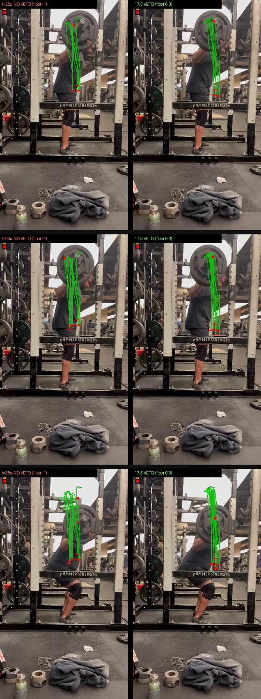

<p align="center">
  
</p>

<p align="center">
  <a href="https://github.com/amadeu01/image-tracker/actions/workflows/ci.yml?query=branch%3Amain"></a>
  <a href="https://github.com/amadeu01/image-tracker/releases/latest"></a>
  <a href="LICENSE"></a>
  
  
  
  <a href="docs/theory.md"></a>
</p>

# image-tracker

Track your barbell from a phone video. **image-tracker** takes an ordinary MP4 of a squat, follows the bar frame by frame, and gives you:

- 📈 **Bar path** — the bar's trajectory drawn over your video
- ⚡ **Velocity in m/s** — real units, calibrated from the known diameter of your plates (one click on each plate edge)
- 🔁 **Rep breakdown** — eccentric/concentric phases, depth, peak & mean concentric velocity (the numbers VBT devices sell you)
- 📊 **CSV/JSON export** — plot it, spreadsheet it, feed it to your coach

No special hardware. No subscription. A tripod, your phone, and `ffmpeg`.

## Why

Velocity-based training tools (GymAware, Vitruve, …) are accurate but expensive, and phone apps lock your own lifting data behind subscriptions. The physics here is simple: a fixed camera, a known length in frame (a plate is a standard size), and decent tracking. That's a weekend of Rust, not a $500 device.

## How it works

1. **Open your video** — a native window (egui) lets you scrub to the frame where the bar is visible.
2. **Place a seed** — click the bar (or a colored marker on the sleeve, if you filmed with one).
3. **Calibrate** — click both edges of a plate; competition plates are 450 mm (or type any known length).
4. **Track** — a template (ZNCC) or color tracker follows the bar; short occlusions are coasted over and flagged, long ones ask you to re-seed.
5. **Get results** — overlay video with the traced path + legend, and CSV/JSON of positions & velocities.

Bonus: the **Marker Color Advisor** analyses your video's palette and tells you which marker color would stand out best in your gym for next time.

## Status

Early development — core tracking (adaptive template + color trackers), GUI with side panel, overlay/CSV/JSON outputs, kinematics + per-rep VBT metrics, telemetry, CI, a strategy shootout (milestone 14), and theory/VBT grounding (16.1) are done (milestones 1–15). In progress: the **tracking-correctness audit (milestone 17)** — an accuracy-vs-confidence metric that grades the tracker against hand-labelled ground truth (17.1), an anchor-veto fix for identity drift (17.3), and first-class confidence threaded through exports (17.4). See [docs/design/tracking-audit-2026-07-21.md](docs/design/tracking-audit-2026-07-21.md) for the audit writeup. See [PLAN.md](PLAN.md) for the live task board and [CONTEXT.md](CONTEXT.md) for the project's vocabulary. Manual smoke-test results are logged under [docs/smoke/](docs/smoke/), latest run linked from that directory's index.

## Requirements

- Rust (stable)
- `ffmpeg` and `ffprobe` on your `PATH` (decode/encode is done via subprocess — see [ADR 0001](docs/adr/0001-shell-out-to-ffmpeg.md))

See [RUNNING.md](RUNNING.md) for full run/install instructions (dev, end user, `cargo install`) and a manual test script used to validate releases.

```bash
git clone https://github.com/amadeu01/image-tracker.git
cd image-tracker
cargo test        # 513 workspace tests
cargo run -p tracker-app -- path/to/video.mp4
```

## Architecture

Cargo workspace, ports-and-adapters with a light DDD core:

```
crates/
├── tracker-core   # pure domain — ZERO dependencies, fully unit-tested
│   ├── geometry     # Point, Frame                      ← value objects
│   ├── patch        # grayscale patch extraction
│   ├── metric       # CorrelationMetric trait, ZNCC     ← port
│   ├── preprocessor # GaussianBlur/Median filters ahead of matching
│   ├── tracker      # Tracker trait + TemplateTracker   ← port + impl
│   ├── color        # HSV color model for the color tracker
│   ├── session      # TrackingSession state machine: gap coasting, reseed, Lost
│   ├── calibration  # pixel↔metric scale from a known plate length
│   ├── velocity     # smoothing + finite-difference kinematics
│   ├── rep          # eccentric/concentric phase segmentation
│   ├── accuracy     # ground-truth grading (PLAN 17.1)
│   ├── suggest      # tracker-type suggestion from a seed patch
│   ├── frame_source # FrameSource / VideoSink traits    ← ports
│   └── bar_path     # BarPath AGGREGATE, rational-fps Timebase
└── tracker-app    # adapters — ffmpeg subprocess IO, egui UI, workers, CLI
    ├── app/         # egui presentation, one module per panel
    ├── *_worker.rs  # dedicated threads owning a resource (decode, thumbnails)
    ├── *_job.rs     # one-shot background work (export)
    └── ffmpeg_*.rs  # subprocess adapters behind the core's ports
```

**The one rule: dependencies point inward.** `tracker-core`'s
`[dependencies]` table is empty and stays empty, so the compiler makes it
impossible for domain code to reach for `egui`, `serde` or the filesystem.
Everything crosses the boundary through four dependency-free traits —
`FrameSource`, `VideoSink`, `CorrelationMetric`, `Tracker` — which is why 233
of the workspace's tests are pure domain tests that run in 0.1 s with no
`ffmpeg` on the `PATH`.

`BarPath` is the single aggregate root, and it is the seam of the whole system:
everything left of it is tracking, everything right of it (reps, velocities,
overlay, CSV/JSON, the accuracy grade) is a pure function of it.

📐 **[docs/architecture.md](docs/architecture.md)** has the full picture — module
dependency graph and data-flow diagrams (Mermaid), the layer table, how DDD is
applied (and deliberately *not* applied), naming conventions that encode the
concurrency model, and the live structural-debt list from the latest
architecture audit.

🧭 **[docs/code-map.md](docs/code-map.md)** is the guided tour for reading the
code — the mental model, how the GUI talks to the core over a channel, the
tracking state machine, the algorithm box by box (search → ZNCC → trust → bar
path → velocity → reps), and an "I want to change X, open Y" navigation table.
Start here if you're new.

The reasoning behind the pipeline — decode/grayscale/matching/gap/smoothing/velocity/rep
stages, why ZNCC and dual-template tracking, noise sources and filter theory — is
written up in [docs/theory.md](docs/theory.md). For a per-strategy deep-dive
(Template/ZNCC, Color model, Gaussian/Median filters — each with an ELI5
paragraph, the actual math, the Rust implementation walkthrough, and a worked
numeric example, plus what the "Test strategies" benchmark measures), see
[theory.md §7, "Strategy deep-dive"](docs/theory.md#7-strategy-deep-dive). For
the physiology and evidence behind the velocity numbers themselves (why
velocity, which variable, loss-threshold ranges, where a phone camera sits
among VBT instruments), see
[theory.md §9, "The sports science behind the numbers"](docs/theory.md#9-the-sports-science-behind-the-numbers-vbt).

Domain language lives in [CONTEXT.md](CONTEXT.md) — every term there appears
verbatim as a Rust type, field or test name, and adding a concept means adding
it to CONTEXT.md in the same commit. Architectural decisions are recorded in
[docs/adr/](docs/adr/); the render-loop rules in
[docs/gui-threading.md](docs/gui-threading.md).

### Correctness & accuracy

All five of the tracker's own metrics — tracked %, gaps, reseeds, mean
score, mean jitter — measure its *self-confidence*, not whether it's
actually on the bar; a confident false lock onto rack steel maximises every
one of them. The `grade` CLI subcommand instead scores an exported run
against hand-labelled ground truth (see [groundtruth/README.md](groundtruth/README.md)
and [PLAN 17.1](PLAN.md)). The image below is from the milestone 17 audit:
left is pre-veto drift walking the tracker onto the rack; right is the same
clip after the 17.3 anchor-veto fix holding the bar through the whole set.

<p align="center">
  
</p>

## Contributing

Contributions welcome! The project is built strictly test-first:

1. Pick a `todo` task from [PLAN.md](PLAN.md) (tasks are sized S/M — anything bigger gets split first).
2. TDD it: one failing test → minimal code to green → refactor. Tests target public behavior, never internals.
3. No `unwrap()` outside tests. `tracker-core` stays dependency-free. GUI changes must obey the [GUI threading rules](docs/gui-threading.md) — never block the eframe `update` thread (no synchronous decode/subprocess/dialog in the render loop).
4. Use the vocabulary from [CONTEXT.md](CONTEXT.md) in names and tests; if you introduce a term, add it there. Know which layer you're in — [docs/architecture.md](docs/architecture.md) §3 has the dependency rule and §5 the file/naming conventions.
5. Changing tracking behaviour? Prove it by **grading against ground truth**, not by watching a self-reported metric improve — see [docs/architecture.md §5](docs/architecture.md#5-how-the-code-is-organised).
5. Update your task's status row in PLAN.md in the same commit, and open a PR.

Found a bug or have a video the tracker chokes on? Open an issue with the clip (or a few frames) attached.

## License

[MIT](LICENSE) © Amadeu Cavalcante Filho
