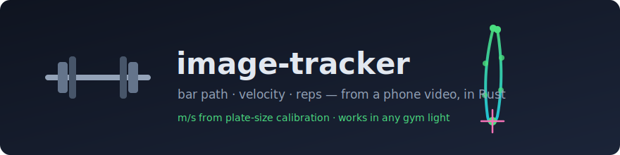

<p align="center">
  
</p>

<p align="center">
  <a href="LICENSE"></a>
  
  
</p>

# image-tracker

Track your barbell from a phone video. **image-tracker** takes an ordinary MP4 of a squat, follows the bar frame by frame, and gives you:

- 📈 **Bar path** — the bar's trajectory drawn over your video
- ⚡ **Velocity in m/s** — real units, calibrated from the known diameter of your plates (one click on each plate edge)
- 🔁 **Rep breakdown** — eccentric/concentric phases, depth, peak & mean concentric velocity (the numbers VBT devices sell you)
- 📊 **CSV/JSON export** — plot it, spreadsheet it, feed it to your coach

No special hardware. No subscription. A tripod, your phone, and `ffmpeg`.

## Why

Velocity-based training tools (GymAware, Vitruve, …) are accurate but expensive, and phone apps lock your own lifting data behind subscriptions. The physics here is simple: a fixed camera, a known length in frame (a plate is a standard size), and decent tracking. That's a weekend of Rust, not a $500 device.

## How it works

1. **Open your video** — a native window (egui) lets you scrub to the frame where the bar is visible.
2. **Place a seed** — click the bar (or a colored marker on the sleeve, if you filmed with one).
3. **Calibrate** — click both edges of a plate; competition plates are 450 mm (or type any known length).
4. **Track** — a template (ZNCC) or color tracker follows the bar; short occlusions are coasted over and flagged, long ones ask you to re-seed.
5. **Get results** — overlay video with the traced path + legend, and CSV/JSON of positions & velocities.

Bonus: the **Marker Color Advisor** analyses your video's palette and tells you which marker color would stand out best in your gym for next time.

## Status

Early development — domain core (geometry, ZNCC template tracking, gap handling, path aggregate) is built and tested; video IO and UI are in progress. See [PLAN.md](PLAN.md) for the live task board and [CONTEXT.md](CONTEXT.md) for the project's vocabulary.

## Requirements

- Rust (stable)
- `ffmpeg` and `ffprobe` on your `PATH` (decode/encode is done via subprocess — see [ADR 0001](docs/adr/0001-shell-out-to-ffmpeg.md))

```bash
git clone https://github.com/amadeu01/image-tracker.git
cd image-tracker
cargo test        # 39 domain tests and counting
cargo run -p tracker-app -- path/to/video.mp4   # UI lands in milestone 2
```

## Architecture

Cargo workspace, hexagonal-ish:

```
crates/
├── tracker-core   # pure domain — zero dependencies, fully unit-tested
│   ├── geometry   # Point, Frame
│   ├── patch      # grayscale patch extraction
│   ├── metric     # CorrelationMetric trait, ZNCC
│   ├── tracker    # TemplateTracker (search window, best match)
│   ├── session    # gap coasting, re-seed, interpolation
│   └── bar_path   # BarPath aggregate, rational-fps Timebase
└── tracker-app    # adapters — ffmpeg subprocess IO, egui UI, overlay, export
```

Domain language lives in [CONTEXT.md](CONTEXT.md); architectural decisions in [docs/adr/](docs/adr/).

## Contributing

Contributions welcome! The project is built strictly test-first:

1. Pick a `todo` task from [PLAN.md](PLAN.md) (tasks are sized S/M — anything bigger gets split first).
2. TDD it: one failing test → minimal code to green → refactor. Tests target public behavior, never internals.
3. No `unwrap()` outside tests. `tracker-core` stays dependency-free.
4. Use the vocabulary from [CONTEXT.md](CONTEXT.md) in names and tests; if you introduce a term, add it there.
5. Update your task's status row in PLAN.md in the same commit, and open a PR.

Found a bug or have a video the tracker chokes on? Open an issue with the clip (or a few frames) attached.

## License

[MIT](LICENSE) © Amadeu Cavalcante Filho
