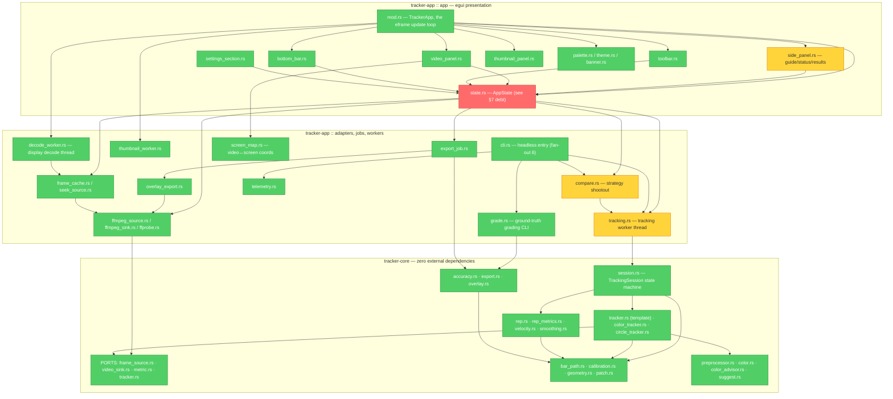
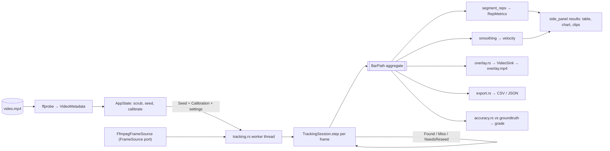

# Architecture

How image-tracker is organised, why the boundaries sit where they do, and the
rules that keep them there. Companion documents: [CONTEXT.md](../CONTEXT.md)
(the ubiquitous language), [docs/theory.md](theory.md) (the maths and the
sports science), [docs/adr/](adr/) (decision records),
[docs/gui-threading.md](gui-threading.md) (the render-loop rules).

Last verified against the tree by the Brooks-Lint architecture audit of
**2026-07-23** (health score 69/100). The "Known structural debt" section at
the bottom is that audit's live finding list — it is expected to shrink, and
PLAN.md carries the tasks.

---

## 1. The shape in one sentence

A Cargo workspace of two crates: **`tracker-core`** holds the domain — bar
paths, reps, trackers, calibration — as pure dependency-free Rust, and
**`tracker-app`** holds everything that touches the outside world — ffmpeg
subprocesses, the egui window, the CLI, files and threads.

That split is the whole architecture. Everything below is detail about how it
is enforced.

---

## 2. Module dependency graph

Nodes are modules, not files. Arrows point *from* the dependent *to* its
dependency, so every arrow in this diagram points downward through the layers —
that is the invariant.



Colours are the 2026-07-23 audit verdict: 🔴 has a Critical finding, 🟡 a
Warning, 🟢 clean. See §7.

---

## 3. Layers and the dependency rule

| Layer | Lives in | May depend on | Must never depend on |
|-------|----------|---------------|----------------------|
| **Domain** | `tracker-core/src/*` | `std` only | anything — the `[dependencies]` table is empty and stays empty |
| **Ports** | `tracker-core`: `FrameSource`, `VideoSink`, `CorrelationMetric`, `Tracker` | domain types | any concrete adapter |
| **Adapters / jobs** | `tracker-app`: `ffmpeg_*`, `*_worker`, `*_job`, `compare`, `grade` | domain + ports + crates.io | the `app::` UI modules |
| **Presentation** | `tracker-app/src/app/*` | adapters, domain | nothing above it — it *is* the top |
| **Composition roots** | `main.rs`, `cli.rs`, `app::run` | everything | — |

**The one rule:** dependencies point inward, toward the domain. `tracker-core`
declares an empty `[dependencies]`, so the compiler enforces the important half
of that rule — it is physically impossible for domain code to reach for
`egui`, `serde`, `ffmpeg` or the filesystem. `egui` appears inside `tracker-core`
only in prose comments explaining what the module deliberately does *not* do.

The audit found zero dependency cycles and zero upward arrows.

---

## 4. DDD: what is modelled and how

This is a small domain, so it uses the light end of the DDD toolkit — value
objects, one aggregate, one state machine, ports — and skips repositories and
event sourcing, which would be pure ceremony here.

### Ubiquitous language

[CONTEXT.md](../CONTEXT.md) is the authority. Every term there — *Bar Path*,
*Seed*, *Marker*, *Gap*, *Lost*, *Rep*, *Preprocessor*, *Tracking Strategy*,
*Overlay Video* — appears verbatim as a Rust type, method, or field name, and
in test names. If you introduce a concept, add it to CONTEXT.md **in the same
commit** as the type. If you rename a concept, rename it in both places.

The rule is bidirectional, and that is the point: a name that is hard to define
in CONTEXT.md is usually a modelling mistake, not a naming one.

### Value objects

Small, immutable, defined entirely by their attributes, replaced rather than
mutated: `Point`, `Frame`, `Patch`, `Calibration`, `Timebase`, `Sample`. None
carries an identity or a lifecycle. `Calibration` in particular is the
pixel↔metre conversion made explicit — velocity in m/s only exists downstream
of one, which is why the type is threaded through rather than a loose `f64`
scale factor floating around.

### The aggregate

`BarPath` is the one aggregate root: an ordered, timebase-stamped series of
`PathPoint`s plus the metadata needed to interpret them. Everything a user
ultimately gets — the overlay, the CSV/JSON export, reps, velocities, the
accuracy grade — is derived from a `BarPath`. It owns its invariants
(monotonic frame indices, rational fps rather than a lossy float).

### The state machine

`TrackingSession` (`session.rs`) is the domain's behavioural core, not an
anemic data holder: it owns the `SessionState` transitions — `Tracking` →
`NeedsReseed` (recoverable pause) → `Lost` (terminal, and **opt-in, default
off**) — plus gap coasting, interpolation and reseed. The distinction between
those two failure states is a hard-won domain insight, documented at PLAN 17.4b:
a *recoverable* pause asks the human for a new seed and continues; a *terminal*
state throws the rest of the set away. Confidence is not a reliable enough
signal to drive the terminal one, so by default it does not.

### Ports and adapters

Four traits in `tracker-core` are the only doors in or out:

| Port | Domain need | Real adapter | Test double |
|------|-------------|--------------|-------------|
| `FrameSource` | "give me frames" | `FfmpegFrameSource`, `SeekingFrameDecoder` | in-memory synthetic frames |
| `VideoSink` | "write frames out" | `FfmpegVideoSink<W: Write>` | `Vec<u8>`, byte-for-byte asserted |
| `CorrelationMetric` | "how alike are these patches" | `Zncc` | fixture metrics |
| `Tracker` | "follow this thing" | template / color / circle | scripted trackers |

Every one is dependency-free and substitutable without editing the module under
test — which is why 233 of the 513 tests are pure domain tests that run in
0.1 s with no ffmpeg on the PATH.

### Deliberately *not* DDD

There is no repository, no unit of work, no domain events, no anti-corruption
layer. There is one bounded context. Exports (`export.rs`) and the accuracy
grader (`accuracy.rs`) live in core because they are domain
calculations — *what* a CSV row means — while the file writing that
persists them lives in the app. Adding a repository abstraction over "write a
file next to the video" would be the exact speculative generality §7 flags
elsewhere.

---

## 5. How the code is organised

### Directory conventions

```
crates/
├── tracker-core/src/      # one module per domain concept, flat, no submodules
└── tracker-app/src/
    ├── app/               # egui presentation — one module per panel
    ├── *_worker.rs        # long-lived threads that own a resource
    ├── *_job.rs           # one-shot background work
    ├── ffmpeg_*.rs        # subprocess adapters
    ├── cli.rs             # headless composition root
    └── main.rs            # binary entry
```

`tracker-core` stays deliberately flat: 23 modules, no nesting. A domain this
size does not need a package hierarchy, and flat means every concept is one
`grep` away.

### Naming tells you the concurrency model

- `*_worker.rs` — owns a resource on a dedicated thread for the app's lifetime
  (`decode_worker`, `thumbnail_worker`). Communicates by channel. Coalesces
  requests: a burst of stale "want frame N" messages is drained and only the
  newest serviced, so a worker can never fall more than one unit of work behind.
- `*_job.rs` — one-shot, spawned and joined (`export_job`).
- `tracking.rs` / `compare.rs` — the long-running tracking thread and the
  strategy shootout that drives it repeatedly.
- Everything else is synchronous and called from wherever.

### The threading rule

The eframe `update` thread never blocks. No synchronous decode, no subprocess
spawn-and-wait, no file dialog, no `ffprobe` in the render loop. The full rules
and the pre-merge checklist are in [docs/gui-threading.md](gui-threading.md);
they exist because a synchronous decode in `update` was the root cause of the
GUI freeze fixed in PLAN 18.1, and because the pattern is easy to
reintroduce — by humans and by LLMs alike.

### Testing conventions

- Tests live in `mod tests` at the bottom of the file they test — no separate
  test tree.
- Tests target public behaviour, never internals.
- Test names are sentences in the ubiquitous language:
  `a_miss_between_low_confidence_founds_resets_the_suspect_streak`.
- TDD is mandatory for new work: one failing test, minimal code to green,
  refactor.
- No `unwrap()` outside tests.
- Tests needing real ffmpeg are `#[ignore]`d and run manually.

### Correctness is graded, not self-reported

The single most important lesson in this codebase, from the milestone 17 audit:
**the tracker's own metrics measure confidence, not correctness.** Tracked %,
gap count, mean ZNCC score and jitter are all *maximised* by a confident false
lock onto a rack upright. They cannot referee themselves.

The referee is `groundtruth/*.csv` — hand-labelled positions — scored by the
`grade` subcommand against an exported run. Any change to tracking behaviour is
validated by re-grading, not by watching a metric go up. `scripts/smoke-report.sh`
runs that grading in CI. Current proven baseline: v3 85 % within 0.1 plate-dia,
v4 100 % (mean 3.2 px). Background:
[docs/design/tracking-audit-2026-07-21.md](design/tracking-audit-2026-07-21.md),
[groundtruth/README.md](../groundtruth/README.md).

---

## 6. Data flow of one tracking run



The `BarPath` in the middle is the seam: everything left of it is tracking,
everything right of it is derivation and presentation, and every output is a
pure function of the aggregate. That is what makes the domain testable without
a video file.

---

## 7. Known structural debt

From the Brooks-Lint architecture audit, 2026-07-23. Each item follows
Symptom → Consequence → Remedy, and each has a PLAN.md task.

### 🔴 `AppState` is a god object — PLAN 19.5

`app/state.rs` is 2708 lines; `AppState` declares 27 public fields spanning
seven unrelated concerns; `impl AppState` is 1034 lines across ~48 methods, of
which `poll_tracking` alone is 114. *Consequence:* every new Results or live
feature widens the same struct, so unrelated workstreams serialise on one file
and the state machine exceeds what anyone can hold in working memory — which is
the shape of the open 19.2 bug. *Remedy:* split by concern into
`state/jobs.rs` (the three handle/poll pairs), `state/review.rs`
(`SessionResults`, rep selection, clip playback) and `state/session.rs` (seed,
calibration, frame position), keeping `AppState` as a thin composition root.
Do it **before** the features that land in it.

### 🟡 Divergent change in `state.rs` — PLAN 19.5

The same file is edited for tracking, export, benchmarking, calibration and
Review UX. *Consequence:* `git bisect` and code review both lose resolution
when a benchmark regression ships in the same file region as a UI tweak.
*Remedy:* as above — the three `poll_*` pairs are the cleanest seam because
each already owns a distinct handle type.

### 🟡 `side_panel.rs` mixes three abstraction levels — PLAN 19.5

1338 lines holding education copy, status sections, the rep table, a
hand-painted velocity chart with nine layout constants, and file/event
sections. Grown by 19.4, about to be grown by 19.3. *Remedy:* extract
`app/results/{rep_table,velocity_chart,education}.rs`; `side_panel.rs` keeps
only section orchestration.

### 🟡 Two more files past the size threshold — PLAN 19.6

`tracking.rs` (2043 lines) and `compare.rs` (1399) are on the same trajectory
`state.rs` took; the audit that flagged `app.rs` at 872 lines was right early.
*Remedy:* not a refactor this milestone — a CI guardrail failing any non-test
`.rs` body over ~800 lines, so this stops being rediscovered by audit.

### 🟢 Two disproven tracker strategies still in the compare matrix — PLAN 17.6

`color_tracker.rs` (577 lines) carries the indistinct-colour note on all four
test videos and posts 0.27 mean fill-fraction on v3 with up to 39 reseeds;
`circle_tracker.rs` (635 lines) graded 17 % / 0 % against the template
tracker's 85 % / 100 %. *Consequence:* 1212 maintained lines whose current
function is producing misleading benchmark rows — Color's deceptively low
jitter (a blob centroid wandering smoothly) actively flatters a failing
tracker. *Remedy:* gate Color behind a positive `suggest_tracker` result;
keep Circle gated as an honest, documented negative result.

### Clean

- **Layering:** zero cycles, zero upward dependencies, `tracker-core` genuinely
  dependency-free.
- **Seams:** all four ports are dependency-free traits with real test doubles;
  infrastructure is substitutable without editing the module under test.
- **Conway's Law:** not applicable — single-owner repository.
