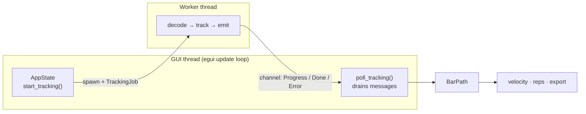
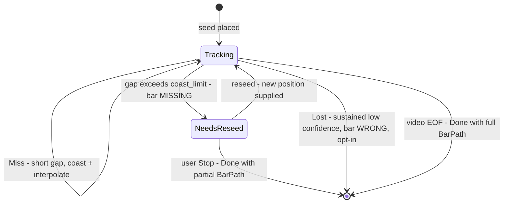
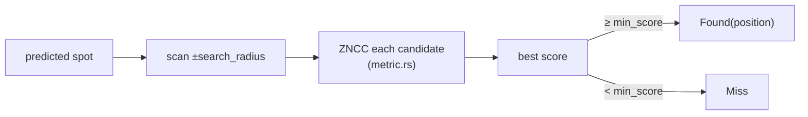
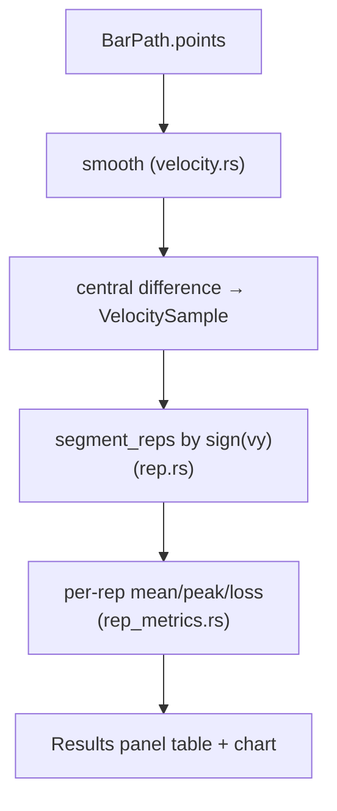

# Code Map — how to read this codebase

A guided tour for someone opening this repo for the first time. It answers:
where does a tracking run start, how does a frame become a velocity number,
how does the GUI talk to the domain, and which file do I open to change X.

Companion docs — read in this order if you're new:
1. [CONTEXT.md](../CONTEXT.md) — the vocabulary (Bar Path, Seed, Gap, Lost, Rep…). Every term is a real type name.
2. **This file** — the mental model and the navigation map.
3. [docs/architecture.md](architecture.md) — the layer rules, DDD application, dependency graph.
4. [docs/theory.md](theory.md) — the maths (ZNCC, smoothing, velocity) and the sports science.

---

## 1. The one-paragraph mental model

A **worker thread** decodes the video one frame at a time and, for each frame,
asks a **tracker** "where did the bar go?" — a small template-matching search
scored by **ZNCC**. A **session state machine** decides whether to trust each
answer (accept it, coast over a short gap, or pause for a reseed). Accepted
positions accumulate into the **`BarPath` aggregate** — a time-stamped list of
points. Once the run finishes, `BarPath` is pure input to offline maths:
**velocity** (difference neighbouring points ÷ time), **reps** (segment by
up/down direction), and **exports** (CSV/overlay). The **GUI never touches the
tracker directly** — it spawns the worker and reads progress messages off a
channel. That thread split is deliberate (the render loop must never block).



---

## 2. How the GUI talks to the core (the boundary)

Three layers, dependencies point inward (see architecture.md §3):

```
egui panels  ─read/write─►  AppState  ─spawns─►  worker thread  ─calls─►  tracker-core (domain)
(app/*.rs)                 (app/state/*)         (tracking.rs)            (session.rs, tracker.rs, …)
```

- **The GUI never calls `Tracker::step` or `TrackingSession::step` directly.**
  It calls `AppState::start_tracking()`, which spawns the worker and returns a
  `TrackingHandle` (a channel sender + receiver).
- Communication is **one channel, three message types** (`tracking.rs:254`):

```rust
pub enum TrackingMessage {
    Progress { video_frame_index, position, source, state },  // one per frame
    Done(BarPath),                                            // run finished, here's the result
    Error(String),                                            // ffmpeg/decode failure
}
```

- Every UI frame, `poll_tracking()` (`app/state/jobs.rs:166`) drains the channel
  with `try_recv` (never blocks), advances the displayed frame, and on `Done`
  stores the `BarPath` and kicks off `SessionResults` derivation.

**Why a thread at all:** a squat is thousands of frames; decoding + tracking
takes seconds. Doing it in the egui `update()` loop freezes the window. The
worker owns the ffmpeg subprocess and the decoder; the GUI only ever sees
messages. Full rules: [docs/gui-threading.md](gui-threading.md).

### The mirror image: the display decoder

Separate from tracking, scrubbing the video needs single frames on demand.
That's a *second* worker (`decode_worker.rs`) with its own tiny 16-frame cache.
Don't confuse the two:
- `tracking.rs` worker = sequential decode for a whole run (fast, streaming).
- `decode_worker.rs` = random-access single-frame decode for the scrub bar.

---

## 3. The domains (this app bridges two)

This is a barbell-velocity tracker, so its ubiquitous language spans **computer
vision** and **strength training**. Half the vocabulary comes from each — that's
correct, not confusion (architecture.md §4).

| Domain | Terms | Where |
|--------|-------|-------|
| Computer vision | Seed, Template, ZNCC, Patch, Gap, Occlusion, Drift, Calibration, Marker | `tracker.rs`, `metric.rs`, `patch.rs`, `session.rs` |
| Strength training (VBT) | Rep, eccentric/concentric, depth, mean/peak velocity, velocity loss | `rep.rs`, `rep_metrics.rs`, `velocity.rs` |

**Standard terms** (ZNCC, jitter, drift, ground truth, calibration) any CV
engineer knows — no glossary needed. **Project-local coinages** (anchor veto,
NeedsReseed, Lost, coasting, Marker Color Advisor) are defined in CONTEXT.md —
if you'd have to explain it to a CV hire, it lives there.

---

## 4. The state machine

`TrackingSession` (`session.rs`) is the behavioural core. Three states
(`session.rs:271`):

```rust
pub enum SessionState {
    Tracking,      // normal: following the bar
    NeedsReseed,   // recoverable pause: lost the bar too long, waiting for a human/CLI to re-point it
    Lost,          // terminal: "tracked but wrong" for too long — OPT-IN, default OFF
}
```



### The two "lost the bar" outcomes — they are opposites, don't conflate them

They fire on *different failures* and do *opposite things*. This is the single
most common point of confusion (PLAN 17.4b):

| | `NeedsReseed` | `Lost` |
|---|---|---|
| **What went wrong** | bar is **missing** (occlusion, blur, left frame) | bar is **wrong** (tracker confidently on the rack/mirror) |
| **Tracker has a position?** | no — the search found nothing | yes — but its anchor confidence is untrustworthy |
| **Trigger** | `miss_count > coast_limit` (a gap outlasts the coast budget) | `identity_confidence < lost_confidence` for `sustained_suspect_limit` frames in a row |
| **What it does** | **pauses**, waits for a reseed, run continues | **terminates** the run, emits the partial `BarPath` |
| **Ends the run?** | **no** (recoverable) | **yes** (terminal) |
| **Default** | always on | **OFF** (opt-in) |

So, answering the obvious question directly:

- **`Lost` DOES terminate.** It is *not* the state that keeps asking you to
  reseed — that's `NeedsReseed`. When Lost fires, the worker ends the run right
  there (`tracking.rs:953`, "terminal, unlike NeedsReseed below") and hands back
  whatever bar path it had up to that frame. No reseed prompt.
- **`NeedsReseed` is the one that pauses and asks**, and never terminates on its
  own — it waits on the reseed channel (a user Stop is the only thing that ends
  it, via the same partial-`Done` path).

### What "Lost is default OFF" actually means for a run

Because Lost is the terminal one, a *wrong* Lost trigger is expensive — it kills
a good run early. And confidence can't reliably tell a correct-but-dim track
(~0.3–0.6 on a shiny plate) from a genuine false lock (~0.4–0.46) — the bands
overlap. So Lost is **off by default**:

- **Lost OFF (default):** the run *never* self-terminates on low confidence. The
  only "lost the bar" path that can fire is `NeedsReseed` → pause + ask. The run
  ends only on video EOF or a user Stop. This is why a genuine loss "pauses
  instead of dead-ending."
- **Lost ON (opt-in, for footage with reliable confidence — e.g. a real colored
  Marker):** a sustained false lock terminates the run with partial results,
  rather than letting it keep exporting confident-looking samples off the wrong
  object (audit F5, "tracked but wrong").

### Coasting (the third, milder failure response)

- **Coasting** — a *short* `Miss` streak (still within `coast_limit`) doesn't
  stop or pause anything. The session predicts forward along the velocity
  estimate (`Track::coasted`, widening the search gate as it goes) and, once the
  bar reappears, interpolates across the gap — marking those filled-in points
  `Source::Interpolated` so velocity/exports can exclude them honestly. Coasting
  is what a gap does *before* it grows long enough to become `NeedsReseed`.

---

## 5. The main algorithm, box by box

### 5.1 The run loop — `tracking.rs`

`run_tracking_worker` (`tracking.rs:594`) sets up ffmpeg, decodes to the seed
frame, builds the tracker, then `finish_tracking_run` → `run_tracking_loop`
does the cycle:

```rust
loop {
    // 1. honour Pause/Stop before touching the next frame
    match control_rx.try_recv() { Stop => return Stopped, Pause => …, _ => {} }

    // 2. pull ONE frame (streaming — never buffer the whole video)
    match source.next_frame()? {
        Some(frame) => {
            session.step(&frame, dt);   // the decision (5.2 + 5.3)
            tx.send(TrackingMessage::Progress { … });   // tell the GUI
        }
        None => return Ok(LoopOutcome::Completed),   // EOF → build BarPath
    }
}
```

`dt` = seconds per frame = `1/fps`, fed to every `step` so the motion model
knows how much time passed.

### 5.2 The search — `tracker.rs`, `TemplateTracker::step`

"Where did the bar go?" = guess with the motion model, scan a box around the
guess, score each spot with ZNCC, keep the best.

```rust
let predicted = track.predicted(dt);          // motion model's guess
let r = self.config.search_radius;
let mut best = None;
for dy in -r..=r {
    for dx in -r..=r {
        let candidate = /* patch at predicted + (dx,dy) */;
        let anchor_score   = metric.score(&self.anchor,   &candidate); // vs ORIGINAL seed
        let adaptive_score = metric.score(&self.adaptive, &candidate); // vs recent appearance
        let score = anchor_score.max(adaptive_score);
        if score > best_score { best = Some((position, score, …)); }
    }
}
match best {
    Some((position, score, …)) if score >= min_score => Found { position, … },
    _ => Miss,
}
```

- **ZNCC** (`metric.rs`, `Zncc::score`) = zero-mean normalized cross-correlation:
  patch similarity from −1..+1, ignoring brightness/contrast. Textbook CV metric.
- **anchor vs adaptive** = the anchor veto (PLAN 17.3): matching against the
  *original* seed (anchor) as well as the recent look (adaptive) resists slow
  drift onto the rack. The anchor score must clear `anchor_floor` for a
  candidate to be eligible at all.



### 5.3 The trust layer — `session.rs`, `TrackingSession::step`

A raw `Found` isn't accepted blindly. Mid-gap guards demote a suspicious match
back to `Miss` (catches confident-but-wrong locks):

```rust
let outcome = match outcome {
    Found { position, .. } if in_gap && distance(last_pos, position) > max_reacquire_distance => Miss,
    Found { score, .. }    if in_gap && score < reacquire_min_score                            => Miss,
    other => other,
};
match outcome {
    Found { position, identity_confidence, .. } => {
        self.track = self.track.observed(position, dt);   // feed the motion model
        self.samples.push(Sample { frame_index, position, source: Tracked, confidence });
    }
    Miss => { /* extend gap; if too long → NeedsReseed */ }
}
```

### 5.4 The storage aggregate — `bar_path.rs`

Accepted samples + gaps become the `BarPath`. This is **the seam**: tracking
ends here, all maths begins here.

```rust
pub struct PathPoint {
    pub frame_index: u64,
    pub t_seconds: f64,      // frame_index × fps_den/fps_num  — time lives here
    pub position: Point,     // pixels
    pub source: Source,      // Tracked / Interpolated / Seed
}
pub struct BarPath { points: Vec<PathPoint>, gaps: Vec<Gap>, /* + timebase */ }
```

Note: a `PathPoint` holds **position + time, not velocity**. Velocity is derived
later.

### 5.5 Velocity — `velocity.rs` (NOT a sum of vectors)

Common misconception: there is no accumulation of little direction vectors.
Velocity = **derivative of position** = difference neighbouring points ÷ time
between them (central finite difference).

```rust
let smoothed = smooth_positions(points, window)?;   // 1. de-noise first
for i in 0..n {
    let (lo, hi) = if i == 0 {(0,1)} else if i == n-1 {(n-2,n-1)} else {(i-1,i+1)};
    let dt = smoothed[hi].t_seconds - smoothed[lo].t_seconds;
    let dx = smoothed[hi].position.x - smoothed[lo].position.x;
    let dy = smoothed[hi].position.y - smoothed[lo].position.y;
    let vx = scale(dx) / dt;              // scale() = px→metres IF Calibration present
    let vy = scale(dy) / dt;
    let speed = (vx*vx + vy*vy).sqrt();
}
```

1. **Smooth first** — differencing raw jitter amplifies noise into fake spikes.
2. **Central difference** — `(next − prev) / Δt`.
3. **`scale()`** — with a `Calibration` (you clicked both plate edges),
   `px_to_meters` converts to **m/s**; without, stays **px/s**. Same code, unit
   decided by presence of calibration.

### 5.6 Reps and averages — `rep.rs`, `rep_metrics.rs`

"Average bar velocity" is **per rep**, not per video. `segment_reps` splits the
velocity series into eccentric/concentric phases by the sign of `vy` (down vs
up); `rep_metrics` aggregates each concentric phase:

- **Mean velocity** = concentric displacement ÷ concentric duration (the VBT default)
- **Peak velocity** = max `speed` in the phase
- **Velocity loss** = drop from rep 1's mean to the worst rep (fatigue proxy)



---

## 6. Confidence vs correctness — the load-bearing lesson

The single most important thing to internalise (milestone 17):

> **The tracker's self-metrics measure confidence, not correctness. A confident
> false lock maxes them all.**

- **Self-metrics** (ZNCC score, tracked %, jitter, gaps/reseeds) are computed
  from the tracker's *own output*. They are legitimate *runtime* signals — the
  tracker needs them live to decide "coast this gap? pause? trust this match?"
- **They cannot certify correctness.** A blob gliding across a wall has
  *beautiful* low jitter while tracking nothing. That's why the `compare`
  benchmark once recommended a failing tracker (PLAN 20.3).
- **The only referee is ground truth.** `groundtruth/*.csv` = human-labelled
  real positions; the `grade` subcommand scores a run against them. Any tracking
  change is validated by re-grading (`scripts/smoke-report.sh` in CI), never by
  watching a self-metric improve.

Two jobs, both kept: self-metrics *steer* the tracker at runtime; ground truth
*judges* it offline.

### 6.1 The five signals in detail — when called, compared, transformed, checked

Two families. **Measured, live** signals run *inside the per-frame loop* and
change what the tracker does next. **Derived** signals are *post-hoc arithmetic*
on the finished output — nobody measures them live.

| Signal | Kind | File | Called from |
|--------|------|------|-------------|
| ZNCC peak | measured, live | `metric.rs` | `TemplateTracker::step`, once per candidate |
| anchor veto | measured, live | `tracker.rs` (17.3) | `TemplateTracker::step`, gates eligibility |
| motion reachability | measured, live | `motion.rs` (17.2) | `TemplateTracker::step`, gates acceptance |
| jitter | derived | `compare.rs` | `compute_metrics`, after the run |
| gaps / reseeds | derived | `compare.rs` / `session.rs` | `compute_metrics` / live gap logic |

---

#### (1) ZNCC peak — "does this spot look like my template?"

**When:** called once for *every* candidate patch in the search window, every
frame. Window is `(2·search_radius+1)²` positions → hundreds of ZNCC calls per
frame.

**How the data is transformed** (`metric.rs`, `Zncc::score`): each patch is
turned into a zero-mean, contrast-normalized vector, then correlated:

```rust
let mean_a = av.iter().sum::<f64>() / n;      // subtract each patch's brightness
let mean_b = bv.iter().sum::<f64>() / n;      //   → "zero-mean" (shadow-proof)
for i in 0..av.len() {
    let da = av[i] - mean_a;
    let db = bv[i] - mean_b;
    num   += da * db;                          // dot product of the two
    var_a += da * da;                          // each patch's spread
    var_b += db * db;
}
let denom = (var_a * var_b).sqrt();            // normalize by contrast
if denom == 0.0 { return Some(0.0); }          // guard: constant patch, no NaN
Some(num / denom)                              // result in [-1, +1]
```

**How it's checked:** two guards before you ever see a score — mismatched patch
sizes → `None`; a flat (zero-variance) patch → `0.0`, never a divide-by-zero.
The score itself is *compared* two ways downstream: it must beat the current
`best` in the search loop, and the winner must clear `min_score` (default 0.5)
to count as `Found` at all.

**The trap:** a high peak means "looks like the template," not "is the bar." A
chrome rack upright scores high too. That's what the next two signals exist to
catch.

**Go deeper:** [theory.md §2](theory.md#2-template-matching-theory) has the full
ZNCC treatment — SSD vs NCC vs ZNCC, the affine-invariance proof, where it comes
from (Pearson `r` → matched filter → normalized correlation), a line-by-line
walkthrough of this same code, and textbook/article references.

---

#### (2) anchor veto — "is it still the *original* seed, not just last frame?"

**When:** inside the same search loop, computed alongside the ZNCC peak for each
candidate — but against **two** templates, not one.

**How it works** (`tracker.rs`, `TemplateTracker::step`): the tracker keeps an
`anchor` (captured once at the seed, never changes) and an `adaptive` (refreshed
as the bar's appearance changes). A candidate is **eligible only if the anchor
still recognizes it**:

```rust
let anchor_score   = metric.score(&self.anchor,   &candidate);  // vs the ORIGINAL seed
let adaptive_score = metric.score(&self.adaptive, &candidate);  // vs the recent look

// THE VETO: reject outright if the never-changing anchor lost it.
let Some(anchor_score) = anchor_score.filter(|a| *a >= self.config.anchor_floor)
    else { continue; };                         // candidate discarded entirely

// Only among anchor-approved candidates does the adaptive get a vote:
let score = match adaptive_score {
    Some(b) => anchor_score.max(b),             // adaptive can REFINE, not OVERRIDE
    None    => anchor_score,
};
```

**Why it's checked this way:** without the veto, `max(anchor, adaptive)` would
let a candidate the anchor *rejects* win on the adaptive's score alone — and
then the adaptive refreshes from that wrong match, writing the error back into
itself. A **drift ratchet** with no restoring force (audit F3). The anchor floor
(default 0.3, deliberately *below* `min_score`) is the ratchet's pawl: the
adaptive handles legitimate appearance change (a rotated plate), the anchor
vetoes an identity change (the rack).

---

#### (3) motion reachability — "could the bar physically get there in one frame?"

**When:** checked once, on the *winning* candidate, after the search picks it —
every frame, gap open or not (audit F2).

**How it's transformed & checked** (`motion.rs`): a `Track` carries position +
velocity + an uncertainty radius. Two pieces:

```rust
// the search CENTERS on the prediction, not the last position (audit F1):
pub fn predicted(&self, dt: f64) -> Point {
    Point::new(self.position.x + self.velocity.x * dt,   // constant-velocity guess
               self.position.y + self.velocity.y * dt)
}

// the reachability RADIUS the winner must fall within:
pub(crate) fn gate_radius(track: &Track, max_velocity: f64, dt: f64) -> f64 {
    max_velocity * dt + track.uncertainty     // farthest a bar could move in dt, + coast slack
}
```

The acceptance check in `tracker.rs`:

```rust
Some((position, score, ..))
    if score >= self.config.min_score
        && distance(position, track.position) <= gate_radius(track, self.config.max_velocity, dt)
    => Found { position, .. },
_   => Miss,     // too far to be physically real → rejected regardless of score
```

**How the state evolves:** on a `Found`, `Track::observed` re-derives velocity
from the displacement and resets uncertainty to 0. On a `Miss`, `Track::coasted`
moves along the prediction and *grows* uncertainty (`growth_per_second · dt`) —
so the longer the bar is unseen, the wider the gate opens for reacquisition.
`max_velocity` default is 3000 px/s. Note it's a *velocity* bound, not
acceleration-from-rest — an accel gate off a stationary seed could never
bootstrap the first real motion (the frame-25 false-loss regression, 17.2).

---

#### (4) jitter — derived, post-hoc

**When:** not live at all. Computed once, after the whole run, in
`compare.rs::compute_metrics` — pure arithmetic on the positions the tracker
already emitted.

```rust
if let Some(prev) = last_tracked {              // only between CONSECUTIVE TRACKED points
    let dx = position.x - prev.x;               //   (misses are skipped, not counted as jumps)
    let dy = position.y - prev.y;
    jitter_sum += (dx*dx + dy*dy).sqrt();        // Euclidean step distance
    jitter_count += 1;
}
last_tracked = Some(position);
// ...
mean_jitter = (jitter_count > 0).then_some(jitter_sum / jitter_count);   // average
```

**What's checked:** it skips over misses (`last_tracked`, not `last_frame`) so a
gap doesn't fake a huge jump; `None` when there were no consecutive tracked
pairs. **Why it can't judge correctness:** low jitter = smooth = a blob gliding
across a wall scores *great* while tracking nothing (PLAN 20.3).

---

#### (5) gaps / reseeds — derived counting

**When:** two contexts. *Live*, `session.rs` opens a gap on a miss-streak and
flips to `NeedsReseed` past the coast limit. *Post-hoc*, `compare.rs` recounts
them from the outcome sequence:

```rust
FrameOutcome::Miss => {
    misses += 1;
    if consecutive_miss == 0 { gaps += 1; }         // a gap = the START of a miss-streak
    consecutive_miss += 1;
    if consecutive_miss > coast_limit {             // streak outlasts the coast budget
        reseeds += 1;                               //   → would force a reseed
        consecutive_miss = 0;                       //   → reset; a longer loss = a fresh gap
    }
}
FrameOutcome::Found { .. } => { consecutive_miss = 0; }   // streak broken
```

**Checked:** `gaps` counts *streaks*, not raw misses (one 40-frame occlusion =
1 gap, not 40); `reseeds` mirrors the CLI's headless auto-resume so the benchmark
number matches real behavior. Both are honest *descriptions* of what the tracker
did — never a verdict on whether it was right.

---

## 7. Navigation map — "I want to change X, open Y"

| I want to understand / change… | File | Entry point |
|--------------------------------|------|-------------|
| GUI starts a run / reads progress | `crates/tracker-app/src/app/state/jobs.rs` | `start_tracking`, `poll_tracking` |
| Background jobs as a state (`Job` enum) | `crates/tracker-app/src/app/state/jobs.rs` | `Job` |
| Review/results state, rep clips | `crates/tracker-app/src/app/state/review.rs` | `SessionResults`, `advance_rep_clip` |
| Seed / calibration / frame position | `crates/tracker-app/src/app/state/session.rs` | `place_seed`, `set_frame` |
| decode + orchestration | `crates/tracker-app/src/tracking.rs` | `run_tracking_worker`, `run_tracking_loop` |
| the search ("where did it go") | `crates/tracker-core/src/tracker.rs` | `TemplateTracker::step` |
| ZNCC similarity metric | `crates/tracker-core/src/metric.rs` | `Zncc::score` |
| trust/veto/gaps/state machine | `crates/tracker-core/src/session.rs` | `TrackingSession::step` |
| motion model / reachability gate | `crates/tracker-core/src/motion.rs` | — |
| the trajectory aggregate | `crates/tracker-core/src/bar_path.rs` | `PathPoint`, `BarPath::new` |
| **velocity maths** | `crates/tracker-core/src/velocity.rs` | `velocity_series` |
| rep segmentation | `crates/tracker-core/src/rep.rs` | `segment_reps` |
| per-rep metrics (mean/peak/loss) | `crates/tracker-core/src/rep_metrics.rs` | — |
| pixel↔metre calibration | `crates/tracker-core/src/calibration.rs` | `px_to_meters` |
| ground-truth grading | `crates/tracker-core/src/accuracy.rs`, `crates/tracker-app/src/grade.rs` | `grade` |
| CSV/JSON export | `crates/tracker-core/src/export.rs` | — |
| overlay video burn-in | `crates/tracker-core/src/overlay.rs`, `crates/tracker-app/src/overlay_export.rs` | — |
| side panel (table/chart/education) | `crates/tracker-app/src/app/side_panel.rs`, `app/results/*` | `show` |
| video panel (path overlay draw) | `crates/tracker-app/src/app/video_panel.rs` | `show` |
| display-frame decode (scrubbing) | `crates/tracker-app/src/decode_worker.rs` | `run_decode_worker` |

---

## 8. Suggested reading order for a new contributor

1. `CONTEXT.md` — learn the words.
2. This file §1–§2 — the mental model + the GUI↔core boundary.
3. `bar_path.rs` — the aggregate everything flows through; small, central.
4. `tracking.rs` `run_tracking_loop` — the cycle that drives everything.
5. `tracker.rs` `TemplateTracker::step` — the actual CV.
6. `session.rs` `TrackingSession::step` — the trust logic + state machine.
7. `velocity.rs` then `rep.rs` — how numbers come out the other end.
8. `docs/architecture.md` — the rules that keep all this decoupled, once the
   shapes are familiar.
