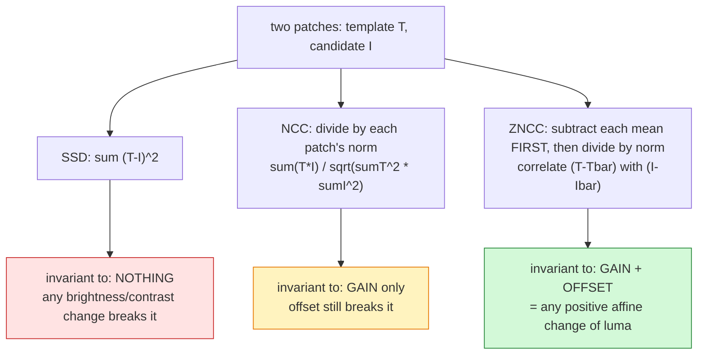

# Theory

The engineering and image-processing reasoning behind image-tracker's
pipeline: why each stage exists, why ZNCC is the matching metric, what noise
we're actually fighting in phone footage, and why some "obvious" fixes
(histogram equalization, sharpening) are wrong for this pipeline. Written for
contributors; assumes familiarity with the vocabulary in
[CONTEXT.md](../CONTEXT.md).

This is a living document. Section 8 (Experiment log) is where empirical
results from `docs/e2e-results.md` and future strategy-benchmark runs (task
11.4) get distilled into durable, dated evidence.

## 1. Pipeline overview

```
 MP4 file
    │  ffmpeg subprocess: decode + rotation (ADR 0001)
    ▼
 Frame (owned RGB buffer, display-space dimensions)
    │  luma = 0.299R + 0.587G + 0.114B  (ITU-R BT.601)
    ▼
 Patch extraction (square region around a point)
    │
    ├── Template Tracker ──▶ ZNCC(anchor|adaptive, candidate) over a
    │                        search window around last known position
    │
    └── Color Tracker ─────▶ HSV match + centroid over a search window
    │
    ▼
 StepOutcome::{Found, Miss}  per frame
    │  Gap logic: coast over short miss runs, interpolate, pause+reseed on long ones
    ▼
 Bar Path (raw positions, Tracked | Interpolated)
    │  centered moving-average smoothing (edge-shrinking window)
    ▼
 Smoothed positions
    │  central finite differences (dt from frame timestamps)
    ▼
 Velocity series (vx, vy, speed; px/s or m/s via Calibration)
    │  sign(vy) segmentation with hysteresis + min phase duration
    ▼
 Reps (eccentric → bottom → concentric)
```

**Decode (ffmpeg, rotation-aware).** Frames come from an `ffmpeg` subprocess
piping rawvideo (see [ADR 0001](adr/0001-shell-out-to-ffmpeg.md)), not a
Rust decoding crate. Phone footage frequently carries a Display Matrix
rotation in `stream_side_data` (e.g. `rotation=-90` for portrait video
stored in a landscape-coded stream); `ffmpeg`'s decoder applies that
rotation automatically to its output, but the *coded* width/height reported
by `ffprobe` is pre-rotation. Every consumer that sizes a `Frame` buffer
must use the *display* dimensions (`display_width()`/`display_height()`,
swapped from coded when rotation is an odd multiple of 90°), or every row is
silently reinterpreted at the wrong stride — the buffer parses without
error, produces plausible-looking numbers, and is completely wrong pixel
data (see §7, 2026-07-15 rotation bug).

**Grayscale conversion.** `patch.rs`'s `luma()` uses
`0.299·R + 0.587·G + 0.114·B` — the ITU-R BT.601 luma weights, matching the
human eye's greater sensitivity to green than red or blue (Recommendation
ITU-R BT.601-7, §2.5.1; the coefficients also appear as "NTSC luma" in
older literature). Everything downstream — `Patch`, `Zncc`, template
matching — operates on this single-channel luma space, never raw RGB: this
keeps template matching correlation cheap (one scalar per pixel) and is
what makes the ZNCC math in §2 exact.

**Region extraction.** `extract_patch` (patch.rs) pulls a square
`(2·radius+1)²` window of luma values around an integer pixel center,
bounds-checked (`None` if any part would fall outside the frame — never a
partial/clamped patch, since a partial patch would silently compare against
a differently-shaped reference).

**Matching.** Two interchangeable `Tracker` implementations (tracker.rs,
color.rs), selected per `TrackingSession` (§2, §4).

**Gap logic** (session.rs). See CONTEXT.md's "Gap": short miss runs coast
(the tracker keeps searching around the last known position) and are
retroactively linearly interpolated once reacquired; a run longer than
`coast_limit` pauses the session (`SessionState::NeedsReseed`) until the
caller re-places the seed.

**Path smoothing → velocity → reps**: §6 below.

## 2. Template matching theory

### SSD vs NCC vs ZNCC

Given a template `T` and a candidate window `I` of the same size (`n`
pixels), three classic similarity/distance measures:

**Sum of Squared Differences (SSD)**

```
SSD(T, I) = Σᵢ (T(i) − I(i))²
```

Cheapest to compute, but not invariant to anything: a uniform brightness
offset (`I = T + c`) or gain change (`I = k·T`) inflates the score even
though the *pattern* hasn't changed at all. Unusable across a rep where
lighting on the plate shifts as it rotates.

**Normalized Cross-Correlation (NCC)**

```
NCC(T, I) = Σᵢ T(i)·I(i)  /  sqrt(Σᵢ T(i)² · Σᵢ I(i)²)
```

Invariant to uniform *gain* (`I = k·T`, `k > 0`) but not to an additive
brightness *offset* — a constant added to every pixel changes the score.

**Zero-mean Normalized Cross-Correlation (ZNCC)** — what this repo uses
(`metric.rs`'s `Zncc`):

```
ZNCC(T, I) = Σᵢ (T(i) − T̄)(I(i) − Ī)  /  sqrt( Σᵢ(T(i) − T̄)² · Σᵢ(I(i) − Ī)² )
```

where `T̄`, `Ī` are the mean luma of the template and candidate patch. This
is exactly the Pearson correlation coefficient between the two patches'
pixel values, so its range is `[-1, 1]`; identical patches score `1.0`, and
a constant (zero-variance) patch is defined as `0.0` here rather than
dividing by zero (`metric.rs` tests: `zncc_of_constant_patch_is_zero_not_nan`).

**The affine-invariance proof — "how do we use contrast".** Let
`I(i) = a·T(i) + b` for any `a > 0`, `b ∈ ℝ` (a positive affine transform:
gain `a` plus offset `b`, i.e. brightness/contrast change). Then:

```
Ī = a·T̄ + b
I(i) − Ī = a·(T(i) − T̄)
```

Substituting into ZNCC's numerator and denominator:

```
numerator:   Σᵢ (T(i) − T̄) · a(T(i) − T̄) = a · Σᵢ (T(i) − T̄)²
denominator: sqrt( Σᵢ(T(i) − T̄)² · Σᵢ a²(T(i) − T̄)² ) = a · Σᵢ (T(i) − T̄)²   (a > 0)

ZNCC(T, I) = [a · Σᵢ(T(i) − T̄)²] / [a · Σᵢ(T(i) − T̄)²] = 1.0
```

The gain `a` cancels top and bottom (subtracting the mean removes the
offset `b` before the ratio is even taken), so ZNCC is *exactly* 1.0 for
any positive affine transform of the template — not approximately, not
"tends to be robust", but algebraically invariant. This is the direct
justification for tracking a plate end-face through a rep even as ambient
lighting brightens/dims and local contrast shifts with rotation: as long as
the appearance change on the patch is well-approximated by an affine
transform of luma, the match score is unaffected. `metric.rs`'s test
`zncc_is_invariant_to_brightness_and_contrast_change` exercises this
directly (`b = 0.5·a + 10`, i.e. `a=0.5, b=10` in the notation above) and
asserts the resulting score is `1.0` to within `1e-4` (numerical, from the
byte round-trip through `Frame`, not floating-point-exact).

This does *not* cover non-affine appearance change (genuine rotation of a
3D object revealing a different texture, specular highlights, occlusion) —
that's what the dual-template design in §3 is for.

### Seeing it — a worked numeric example

Take a tiny 1-D "patch" of 3 luma values, `T = [10, 20, 30]`, and score the
*same pattern* after four different appearance changes. Every candidate below
is the identical shape — only brightness/contrast differs — so the honest
answer we *want* is "still a perfect match". Watch which metric delivers that.
(All numbers computed exactly; `SSD` lower = better, `NCC`/`ZNCC` higher =
better, max `1.0`.)

| Candidate `I` | change | SSD | NCC | ZNCC |
|---------------|--------|----:|----:|-----:|
| `[10, 20, 30]` | identical | **0.0** ✅ | **1.0000** ✅ | **1.0000** ✅ |
| `[20, 40, 60]` | gain ×2 (`2T`) | 1400.0 ❌ | **1.0000** ✅ | **1.0000** ✅ |
| `[50, 60, 70]` | offset +40 (`T+40`) | 4800.0 ❌ | 0.9683 ❌ | **1.0000** ✅ |
| `[60, 80, 100]` | affine (`2T+40`) | 11000.0 ❌ | 0.9827 ❌ | **1.0000** ✅ |
| `[45, 60, 75]` | affine (`1.5T+30`) | 4850.0 ❌ | 0.9827 ❌ | **1.0000** ✅ |

Read down the columns:
- **SSD** is nonzero the moment *anything* changes — it can't even survive a
  gain. A brighter plate reads as "different object".
- **NCC** survives pure gain (`2T` → still 1.0) but the offset rows drop below
  1.0 — adding a constant brightness fools it.
- **ZNCC** is `1.0000` on every row. Gain *and* offset, both removed. That's
  the algebra of the previous section, now visible as a column of `1.0`s.

Why ZNCC's offset rows collapse to a perfect match — the mean subtraction does
it *before* any comparison. For `I = T + 40`:

```
T       = [10, 20, 30]      T̄ = 20   →  T − T̄ = [-10,  0, +10]
I=T+40  = [50, 60, 70]      Ī = 60   →  I − Ī = [-10,  0, +10]   ← identical!
```

The `+40` lives entirely in the mean, so subtracting the mean deletes it. Both
deviation vectors become the same, and their correlation is exactly 1. Gain
does the same trick one step later: `2T` gives deviations `[-20, 0, +20]`,
which the denominator's norm divides back out.

### "Is ZNCC always 1.0?" — no, and this is the important half

The table above shows `1.0000` on every row **on purpose, but it only proves
one thing**: every candidate there was the *same shape* re-lit, and a match
metric *should* return 1 for those. It does **not** mean ZNCC always says
"match". ZNCC returns 1.0 **only when the pattern actually matches** (up to
brightness/contrast). Change the *shape* and it drops — all the way to −1:

| Candidate `I` vs `T=[10,20,30]` | what it is | SSD | NCC | ZNCC |
|---------------------------------|-----------|----:|----:|-----:|
| `[12, 19, 32]` | same rising shape + noise | 9.0 | 0.9979 | **0.9853** — still clearly a match |
| `[20, 20, 20]` | flat (no pattern at all) | 200.0 | 0.9258 | **0.0000** — uncorrelated |
| `[30, 10, 30]` | V-shape (wrong pattern) | 500.0 | 0.8584 | **0.0000** — uncorrelated |
| `[25, 10, 15]` | unrelated | 550.0 | 0.7804 | **−0.6547** — anti-correlated |
| `[30, 20, 10]` | exactly reversed (`T` flipped) | 800.0 | 0.7143 | **−1.0000** — perfect opposite |

Two things jump out:
- **ZNCC uses its full range.** `+1` = same pattern, `0` = no relationship,
  `−1` = inverted pattern. That range is what lets the tracker *reject* a wrong
  spot — a candidate scoring 0.0 or negative isn't the bar.
- **Look at NCC vs ZNCC on the "flat" and "reversed" rows.** NCC still reports
  0.93 and 0.71 — *dangerously high* for patches that are nothing like `T` —
  because without mean-subtraction the shared brightness inflates the score.
  ZNCC correctly reports 0.0 and −1.0. This is the same failure that lets a
  featureless bright wall fool a gain-only metric; it's why the tracker's
  `min_score` threshold (0.5) is meaningful for ZNCC but would be near-useless
  for NCC.

So the earlier all-`1.0` column and this mixed column together are the point:
**ZNCC is invariant to lighting (top table) *and* discriminating about shape
(this table).** A metric that had only the first property would match
everything; only the second would break under lighting. ZNCC has both.

### A 2D example — closer to real pixels

Real patches are 2D grids, not rows of 3. The math is identical — flatten the
grid row-major and run the exact same formula — but a 3×3 makes it look like
pixels. Template `T` is a bright blob (bright center, dim edges):

```
T (3x3 luma):          mean T̄ = 17.8
  10  20  10
  20  40  20
  10  20  10
```

Score it against three candidates:

```
(a) affine re-lit  I = 2T+30      (b) an EDGE (wrong shape)     (c) blob + noise
     50  70  50                        10  10  10                   12  18  11
     70 110  70   ← same blob,         40  40  40  ← bright at      22  38  19  ← blob,
     50  70  50     just brighter      80  80  80    bottom, dark      9  21  10    slightly off
                    /higher contrast                 at top
```

| Candidate | SSD | NCC | ZNCC | verdict |
|-----------|----:|----:|-----:|---------|
| (a) affine re-lit | 21300.0 | 0.9794 | **1.0000** | same blob → perfect match ✅ |
| (b) edge | 14300.0 | 0.7270 | **−0.0564** | different shape → not the bar ✅ |
| (c) blob + noise | 20.0 | 0.9973 | **0.9883** | same blob, noisy → still a match ✅ |

Same story as 1D, now in 2D: the affine re-lit blob is a perfect `1.0` despite
every pixel changing value; the edge — which shares the *same average
brightness* and so fools SSD/NCC less obviously — is correctly near `0` for
ZNCC; real-world noise only nudges the score down a hair. This 3×3 is exactly
what `metric.rs` does on the real `patch_radius`-sized patches, just with
`(2r+1)²` pixels instead of 9.

### The three recipes, side by side

Each metric is the previous one plus one normalization step. That's the whole
story of what makes it robust:



The two normalization knobs map one-to-one onto the two parts of a
brightness/contrast change:

| Step | Removes | Handles |
|------|---------|---------|
| subtract the mean (the **Z**ero-mean) | additive offset `b` | lighting getting brighter/dimmer overall |
| divide by the norm (the **N**ormalized) | multiplicative gain `a` | contrast stretching as the plate rotates |

ZNCC does both, which is exactly why a plate end-face stays a `1.0` match
through a rep even as the lighting on it changes — the whole reason this repo
picks it over the two cheaper options.

### Where ZNCC comes from (origins)

ZNCC isn't a computer-vision invention — it's three older ideas stacked:

1. **Pearson's correlation coefficient (statistics, 1890s).** ZNCC of two
   patches is *exactly* the Pearson product-moment correlation `r` between
   their pixel vectors: subtract each vector's mean, take the dot product,
   divide by the product of the norms. Everything ZNCC "does" (range `[-1,1]`,
   invariance to affine rescaling of either variable) is a property of `r`
   that predates images entirely. If you know `r` from statistics, you already
   know ZNCC — it's `r` applied to flattened patches.
2. **The matched filter (signal processing, 1940s).** Cross-correlation as a
   *detector* — slide a known template over a signal, the correlation peaks
   where the template is present — is the matched filter, the provably optimal
   linear detector for a known shape in additive white noise (North, 1943;
   popularised in Turin's 1960 "An introduction to matched filters"). Template
   matching over an image is that idea in 2-D.
3. **Normalization for real imagery (image processing, 1970s–90s).** Plain
   cross-correlation fails under lighting change; dividing by the local norm
   (NCC) fixes gain, subtracting the local mean (the "zero-mean" / "Z") fixes
   offset. Lewis's 1995 "Fast Normalized Cross-Correlation" is the standard
   modern write-up and the basis for how it's computed efficiently.

So the lineage is **Pearson `r` → matched filter → mean-and-norm normalization
for photographs.** That's why it shows up under different names across fields:
`TM_CCOEFF_NORMED` in OpenCV, "ZNCC" in stereo/digital-image-correlation,
"Pearson correlation" in statistics — same formula.

### The `Zncc` code, line by line

`metric.rs`'s `Zncc::score(a, b)` is the formula above, transcribed directly:

```rust
if a.side() != b.side() { return None; }        // undefined for mismatched sizes → None, not a lie
let (av, bv) = (a.values(), b.values());         // flatten both patches to luma vectors
let n = av.len() as f64;
if n == 0.0 { return Some(0.0); }                // empty patch guard

let mean_a = av.iter().map(|&v| v as f64).sum::<f64>() / n;   // T̄  — the "zero-mean" step…
let mean_b = bv.iter().map(|&v| v as f64).sum::<f64>() / n;   // Ī  — …removes brightness offset b

let (mut num, mut var_a, mut var_b) = (0.0, 0.0, 0.0);
for i in 0..av.len() {
    let da = av[i] as f64 - mean_a;              // T(i) − T̄
    let db = bv[i] as f64 - mean_b;              // I(i) − Ī
    num   += da * db;                            // Σ (T−T̄)(I−Ī)   — the correlation numerator
    var_a += da * da;                            // Σ (T−T̄)²
    var_b += db * db;                            // Σ (I−Ī)²
}

let denom = (var_a * var_b).sqrt();              // sqrt(Σ(T−T̄)² · Σ(I−Ī)²) — the "normalized" step
if denom == 0.0 { return Some(0.0); }            // a flat patch has zero variance → define as 0.0, never NaN
Some(num / denom)                                // Pearson r ∈ [-1, 1]
```

Design choices worth noting:
- **Single pass for the sums of products, two passes overall** (means first,
  then deviations). Not the integral-image fast path from Lewis 1995 — the
  search window here is small (a few hundred candidates), so the simple form
  is clearer and fast enough; the optimisation matters when correlating over a
  whole image.
- **Total functions.** Every degenerate input has a defined answer
  (`None` for size mismatch, `0.0` for empty or zero-variance) — no panics, no
  `NaN` leaking into the tracker's `best`-score comparison. Tests:
  `zncc_of_patch_with_itself_is_one`, `zncc_of_constant_patch_is_zero_not_nan`,
  `zncc_is_invariant_to_brightness_and_contrast_change`.
- **Operates on preprocessed luma**, not raw RGB — the patch has already been
  grayscaled and (optionally) blurred through the same-space chain (§5.4), so
  `values()` is a single channel.

### References

**Articles / papers**

- J. P. Lewis, ["Fast Normalized Cross-Correlation"](https://scribblethink.org/Work/nvisionInterface/nip.pdf),
  Vision Interface, 1995, pp. 120–123. The standard reference for computing
  NCC efficiently via running sums/integral images; also lays out the
  SSD/NCC/ZNCC distinctions used above. (Verified: PDF hosted at the
  author's site, scribblethink.org; also indexed on
  [Semantic Scholar](https://www.semanticscholar.org/paper/Fast-Normalized-Cross-Correlation-Lewis/b482ddd4ddfdd33a709f7f0663d3e5c116ff4d52).)
- B. Pan, K. Qian, H. Xie, A. Asundi,
  ["Two-dimensional digital image correlation for in-plane displacement and strain measurement: a review"](https://iopscience.iop.org/article/10.1088/0957-0233/20/6/062001),
  *Measurement Science and Technology*, 20(6), 062001, 2009,
  doi:[10.1088/0957-0233/20/6/062001](https://doi.org/10.1088/0957-0233/20/6/062001).
  Surveys correlation criteria (including ZNCC) and sub-pixel refinement for
  digital image correlation — the same underlying math as visual template
  tracking, from the experimental-mechanics literature. (Verified via
  IOPscience.)
- L. G. Brown, ["A survey of image registration techniques"](https://dl.acm.org/doi/10.1145/146370.146374),
  *ACM Computing Surveys*, 24(4), 325–376, 1992,
  doi:[10.1145/146370.146374](https://doi.org/10.1145/146370.146374).
  Broader context: where correlation-based matching (this repo's approach)
  sits among feature-based and transform-domain registration methods.
  (Verified via ACM Digital Library and a hosted PDF at
  [sci.utah.edu](https://www.sci.utah.edu/~gerig/CS6640-F2010/p325-brown.pdf).)

**Textbooks — to go deeper**

- R. Szeliski, *Computer Vision: Algorithms and Applications*, 2nd ed.,
  Springer, 2022 — the section on translational alignment / area-based
  matching covers SSD, NCC and normalized correlation as image-alignment
  criteria (the exact context this repo uses them in). Freely available from
  the author: [szeliski.org/Book](https://szeliski.org/Book/). **Best single
  starting point** if you read one thing.
- R. C. Gonzalez & R. E. Woods, *Digital Image Processing*, 4th ed.,
  Pearson, 2018 — the object-recognition / matching-by-correlation material
  derives the normalized correlation coefficient and its brightness/contrast
  invariance from first principles; good if you want the DSP-flavoured
  treatment.
- D. Forsyth & J. Ponce, *Computer Vision: A Modern Approach*, 2nd ed.,
  Pearson, 2011 — filters and correlation as template detection; situates
  correlation matching against feature-based methods.
- G. Bradski & A. Kaehler, *Learning OpenCV*, O'Reilly — the practical
  counterpart: OpenCV's `matchTemplate` with `TM_CCOEFF_NORMED` **is** ZNCC.
  Useful to connect this repo's `metric.rs` to the library most people meet
  the method through.

**Connecting the names:** OpenCV `TM_CCOEFF_NORMED` = ZNCC = Pearson `r` over
patch pixels = the "zero-mean normalized" row of the SSD/NCC/ZNCC table above.
If a source uses any of those names, it's the same formula in `metric.rs`.

For the tracking-specific deep-dive (how ZNCC is used inside
`TemplateTracker::step`, the anchor/adaptive dual template, and a worked
numeric example) see [§7.1 Template tracking (ZNCC)](#71-template-tracking-zncc).
For the code-navigation view see [docs/code-map.md §6.1](code-map.md).

## 3. Seed → template ("pinpointing")

The user's seed click (CONTEXT.md's "Seed") becomes the anchor patch:
`TemplateTracker::new` extracts a `(2·patch_radius+1)²` luma patch centered
on the rounded seed pixel from the seed frame (`tracker.rs`). This single
reference patch is stored twice — as `anchor` and as the initial `adaptive`
— and both are used every subsequent step.

**Why dual templates.** A single fixed template (anchor-only) is exactly
the classical Lucas-Kanade tracking failure mode: as the tracked surface
rotates or lighting shifts, the live appearance diverges from the seed-time
appearance until the match score falls below `min_score`, even though
nothing is actually lost — it's the *reference* that's stale. Naively
replacing the template with the latest match every frame is the opposite
failure: template drift, where each update introduces a small alignment
error that compounds frame over frame until the tracked point has crept
entirely off the object (Matthews, Ishikawa & Baker 2004, below — this is
literally titled "the template update problem").

`tracker.rs`'s `TemplateTracker` resolves this with three pieces working
together:

1. **Anchor** (never updated) — the ground truth of what the user actually
   marked. No matter how long the clip runs, a candidate must still score
   reasonably against the *original* appearance to be findable at all when
   the adaptive template has drifted or been lost. Prevents unbounded
   drift.
2. **Adaptive** (updated from the winning match) — absorbs gradual, real
   appearance change (rotation, lighting) that would otherwise erode the
   anchor-only score below `min_score` over a long clip. Per step, each
   candidate's effective score is `max(anchor_score, adaptive_score)`.
3. **`update_threshold`** — the adaptive template is only replaced when the
   *winning* effective score clears this threshold (default `0.7`,
   comfortably above `min_score`'s default `0.4`). A marginal match
   (occlusion edge, near-miss, background clutter that just clears
   `min_score`) is still accepted as `Found` — the tracker doesn't lose the
   object over a single weak frame — but the adaptive template is not
   allowed to creep toward that marginal evidence. This is the direct
   mechanism preventing "drift by creep": every adaptive-template update is
   gated on genuinely confident evidence, not just "good enough to count as
   found."

This is TDD'd directly: `tracker.rs`'s
`dual_template_stays_found_through_gradual_appearance_change_that_would_lose_anchor_alone`
walks a synthetic non-affine appearance blend from t=0 to t=1 in small
per-frame steps and confirms (a) the dual-template tracker stays `Found`
throughout and (b) the anchor patch scored directly against the final
appearance really has dropped below `min_score` — proving the adaptive
template is doing real work, not just padding coverage.
`marginal_match_below_update_threshold_does_not_refresh_adaptive_template`
proves the threshold gate holds: a repeated marginal-score frame reproduces
the identical score, meaning the adaptive template was never touched by it.

### Reference

- I. Matthews, T. Ishikawa, S. Baker,
  ["The Template Update Problem"](https://www.ri.cmu.edu/pub_files/pub4/matthews_iain_2004_1/matthews_iain_2004_1.pdf),
  *IEEE Transactions on Pattern Analysis and Machine Intelligence*, 26(6),
  810–815, 2004, doi:[10.1109/TPAMI.2004.16](https://doi.org/10.1109/TPAMI.2004.16).
  Formalizes exactly the drift failure mode the anchor+adaptive design
  above is built to avoid. (Verified: PDF hosted at CMU Robotics
  Institute; also on [IEEE Xplore](https://ieeexplore.ieee.org/document/1288530/).)

## 4. Color tracking

`color.rs`'s `ColorModel` is the alternative to template matching, used
when a physical `Marker` (CONTEXT.md) is present on the bar. It samples the
patch around the seed, converts every pixel to HSV
(`rgb_to_hsv`, standard formula: hue via the max-channel case split,
saturation as `(max−min)/max`, value as `max`), and learns:

- **hue** — the circular mean of sampled hues (`median_angle_deg`: sum unit
  vectors, take the angle of the resultant). A plain numeric median would
  be pulled toward 180° for a hue cluster straddling the 0°/360° wrap
  (reds); the circular mean handles this correctly (tested:
  `learn_handles_hue_wraparound_near_red`).
- **saturation** and **value** — plain numeric medians (no wraparound
  issue: both are linear `[0, 1]` ranges).

`ColorModel::matches(rgb)` then checks a pixel against tolerance bands
around each of the three learned values (`hue_tolerance` uses the
wraparound-safe `hue_distance_deg`; saturation/value are plain absolute
difference). The `ColorTracker` (built on this) scans the search window for
matching pixels and reports their centroid as the tracked position.

**Saturation/value floors matter more than they look.** A model learned
from a low-saturation (gray/washed-out) patch is nearly useless as a
selectivity filter — hue is mathematically undefined at zero saturation
(a hue rotation of pure gray doesn't change its RGB at all), so the
saturation and value tolerance bands are what actually keeps a color model
from matching half the frame. `matches_rejects_low_saturation_gray_against_saturated_model`
and its converse (`matches_a_gray_model_rejects_saturated_pixel`) both
exist because either direction (a vivid marker vs. a gray background, or a
gray-tape marker vs. a saturated background) needs the saturation/value
bands, not hue alone, to discriminate.

**When color beats template — and why it doesn't, here.** Color tracking
is the right tool when the tracked object has a color that's genuinely
distinct from its surroundings: a bright marker dot against skin, clothing,
or gym equipment. It is *cheaper* per pixel (HSV conversion + three range
checks vs. a correlation over a whole patch) and immune to the object's own
rotation/appearance change entirely, since it only cares about color, not
shape. But this repo's advisor findings (Marker Color Advisor,
CONTEXT.md) and the actual test footage in `test_videos/` are, in practice,
gyms — chrome plates, black rubber, gray flooring, muted rack paint. There
is no reliably distinct color signature to lock onto without a marker the
lifter physically applies, which most users filming a casual set won't
have done. That's why the Template Tracker is the primary path and the
Color Tracker is the marker-present alternative, not the default (see
CONTEXT.md's "Marker": "Optional: when present, the Color Tracker follows
it; when absent, the Template Tracker follows the bar's own appearance").

## 5. Noise

### Sources in our footage

- **Sensor grain** — ordinary phone-camera photon/read noise, worse in dim
  indoor gym lighting (long or gain-boosted exposure). Manifests as
  independent per-pixel luma jitter frame to frame.
- **WhatsApp H.264 compression blocking** — every video in `test_videos/`
  arrived as a WhatsApp export, which re-encodes at an aggressive bitrate.
  Block-DCT compression introduces visible 8×8/16×16 blocking artifacts and
  ringing near edges, especially on the plate's high-contrast edge against
  the background — exactly where a template patch's boundary sits.
- **Motion blur at rep turnaround** — cheapest here: shutter speed on a
  phone doesn't freeze fast bar motion, so frames near peak concentric/
  eccentric velocity smear the tracked edge across several pixels, while
  frames at the top/bottom turnaround (near-zero velocity) are comparatively
  sharp. This is asymmetric noise: it's worst exactly where the object is
  moving fastest, not uniform across the clip.

### Why noise hurts correlation, and how much ZNCC tolerates

A correlation-based matcher's failure mode from noise is a **false peak**:
independent per-pixel noise on both the reference and candidate patches
adds an uncorrelated component to the numerator's cross term while also
inflating both variance terms in the denominator, pulling every candidate's
score down and — critically — narrowing the score gap between the true
match and a nearby, structurally similar wrong match (e.g. a rack upright
that shares the plate's grayscale range). Below some noise level the wrong
candidate can outscore the true one within the search window.

ZNCC tolerates a meaningful amount of this because it's a *normalized*
statistic — its score depends on the correlation *coefficient* between
patches, not on absolute pixel differences, so it degrades gracefully
(monotonically lower peak score) rather than catastrophically (SSD, by
contrast, has no built-in resistance to a global brightness/contrast shift
riding on top of noise, compounding both failure modes at once). But ZNCC
is not immune: it is a *linear* correlation measure, so it has no special
robustness to blocking artifacts (which are structured, not i.i.d., noise)
or to motion blur (which changes the underlying signal, not just adds noise
to it) — both are why the anchor+adaptive design in §3 exists, rather than
leaning on ZNCC's noise tolerance alone to survive a whole rep.

### Filter theory

- **Gaussian blur** — a linear, isotropic low-pass filter: convolution with
  a Gaussian kernel attenuates high-spatial-frequency content
  (frequency-domain argument: the Fourier transform of a Gaussian is itself
  a Gaussian, so it's a smooth low-pass with no ringing). Effective against
  independent per-pixel sensor grain (which is broadband/high-frequency)
  but blurs real edges too — including the plate boundary the tracker
  actually wants sharp, and it has no special handling for blocking
  artifacts, which are itself already a form of low-frequency-per-block
  distortion that a smooth Gaussian doesn't specifically target.
- **Median filter** — a nonlinear, order-statistic filter: replaces each
  pixel with the median of its neighborhood. Nonlinear filters can remove
  outlier noise (salt-and-pepper, and — usefully here — some blocking
  artifact edges) while preserving genuine step edges much better than a
  linear blur, since the median of a neighborhood straddling a real edge is
  still one of the two "sides'" values, not an interpolated blend.
  Comparatively worse against pure Gaussian sensor grain (no principled
  frequency-domain justification, and it can introduce its own
  "stair-stepping" artifacts on smooth gradients).

Both are candidates for the `Preprocessor` port (CONTEXT.md; task 11.2):
which one (or chain) helps depends on which noise source dominates a given
clip, which is exactly why Tracking Strategy (CONTEXT.md) is made
per-video-swappable rather than hardcoded — task 11.4's strategy benchmark
is what will make this an empirical choice rather than a guess.

### Why not CLAHE/histogram equalization, and why not sharpening

**CLAHE/equalization is redundant under ZNCC's invariance.** Histogram
equalization (and its adaptive/local variant, CLAHE) exists to correct for
uneven brightness/contrast across an image or between two images being
compared. But §2 proved ZNCC is *already* exactly invariant to any global
affine transform of a patch's luma values — precisely the class of
brightness/contrast difference equalization is designed to normalize away.
Running CLAHE before ZNCC spends compute correcting for something the
matching metric already ignores, and — worse — CLAHE is itself a
*nonlinear, spatially-local* transform (it operates per-tile, with
contrast limiting), which means it does not commute with taking the ZNCC
score analytically the way a global affine map does: it can introduce
spurious local contrast structure (halos at tile boundaries, amplified
noise in low-contrast regions like flat rubber flooring) that isn't
present in the source and that isn't cancelled by ZNCC's invariance the
way real affine brightness change is. It's not neutral — it's actively
liable to hurt by manufacturing texture noise ZNCC then has to score
against.

**Sharpening is counterproductive** because unsharp-masking amplifies high
spatial frequencies — exactly the frequency band sensor grain and
compression-block edges occupy. It increases local contrast at genuine
edges, but noise doesn't distinguish itself from a genuine edge to a
sharpening kernel; the net effect on a phone-video patch is amplified
grain and exaggerated blocking-artifact edges, which is the opposite of
what the matcher needs (a stable numerator, tight variance in the
denominator).

### Region-level filtering + the same-space invariant

CONTEXT.md's Preprocessor term is explicit about the constraint that
actually matters here: whatever filter chain runs, it must be applied
identically to the seed's reference patch and to every candidate region —
"reference and candidates must live in the same filtered space for scores
to be comparable." This is not a nicety; it's required for ZNCC's
invariance proof in §2 to hold at all. That proof assumes `T` and `I` are
compared directly; if `T` were filtered with a different kernel (or not
filtered at all) than `I`, the two patches are no longer related by even an
approximate affine transform of the same underlying signal, and ZNCC's
score becomes an artifact of the filter mismatch rather than a measure of
how well the candidate matches the tracked object. Filtering at the
*region* level (after `extract_patch`, before `Zncc::score`) rather than
once on the whole decoded frame is also what keeps this invariant cheap to
guarantee: every comparison point in the pipeline has exactly one
well-defined filtered representation of its patch, with no whole-frame
cache to keep in sync with per-call filter-chain choices (task 11.2's
`Preprocessor` port is designed around this).

## 6. Positional smoothing + kinematics

`smoothing.rs`'s `smooth_positions` runs a centered moving average over the
raw Bar Path *before* `velocity.rs` differentiates it — never the reverse.
This ordering matters because finite differentiation is itself a
high-pass, noise-amplifying operation: for a fixed per-frame position noise
of standard deviation `σ`, a first difference `(x[i+1] − x[i])/dt` has
variance `2σ²/dt²` — noise is amplified by `dt⁻¹` (and further whenever
`dt` is small, i.e. at high frame rate), while any real underlying signal
of that frequency is amplified by the same factor along with it, so raw
tracking jitter of a few pixels turns into velocity spikes of tens of
px/s once divided by a 1/30s frame interval. `velocity.rs`'s own test
`smooths_before_differentiating` demonstrates this directly: a zigzag
position noise with variance-reduced-by-smoothing produces
correspondingly reduced velocity variance, without changing the underlying
linear trend's slope (smoothing a linear ramp reproduces it exactly —
`smoothing.rs`'s `linear_ramp_is_preserved_exactly_by_centered_average` —
so the smoothing doesn't bias the true velocity estimate, it only damps the
noise riding on top of it).

Differencing itself uses a **central difference** at interior points,
`(p[i+1] − p[i−1]) / (t[i+1] − t[i−1])`, and a one-sided (forward/backward)
difference at the two series endpoints where no interior neighbor exists.
Central differencing is second-order accurate (error `O(dt²)`) versus
first-order (`O(dt)`) for a one-sided difference, which is why it's
preferred everywhere it's available.

**VBT mean-velocity standard.** Velocity-based training tools (GymAware,
Vitruve, and the like — see the README's "Why") report *mean concentric
velocity* as their primary metric, because peak velocity within a rep is
sensitive to exactly where the instantaneous sample lands and to
measurement noise, while the mean over the whole concentric phase is a
stable, load-comparable number lifters use to autoregulate training
intensity. `rep.rs`'s `segment_reps` produces the `eccentric_start` /
`bottom` / `concentric_end` indices into the velocity series specifically
so that per-rep metrics (mean and peak concentric velocity, depth) can be
computed over the correctly bounded concentric phase — matching the metric
definition this domain's target users (lifters, per the README) already
expect from commercial VBT devices.

## 7. Strategy deep-dive

Per-strategy reference for the four building blocks a Tracking Strategy
(CONTEXT.md) is assembled from: the two trackers (Template/ZNCC, Color) and
the two preprocessor filters (Gaussian blur, Median). Each gets an ELI5
one-liner (reused verbatim by the GUI's strategy tooltips, task 14.2), an
engineer's walkthrough with the actual math, a Rust walkthrough of the
`tracker-core` implementation with verbatim snippets, and a worked numeric
mini-example. §2–§5 above carry the derivations; this section links rather
than repeats them.

All four implementations are dependency-free Rust: plain `Vec<f32>` /
`Vec<f64>` buffers in row-major order (`data[y * width + x]`), no image
crate, no SIMD, no `unsafe`.

### 7.1 Template tracking (ZNCC)

**ELI5.** Find the sticker that looks most like the sticker you pointed at
— every frame, the tracker slides a little photo of what you clicked over
the nearby area and keeps the spot where the picture lines up best, even if
the lighting got brighter or dimmer.

**Engineer.** Per frame:

1. Take the last known position `(cx, cy)`.
2. For every integer offset `(dx, dy)` with `|dx|, |dy| ≤ search_radius`,
   extract a `(2·patch_radius+1)²` luma patch centered at
   `(cx+dx, cy+dy)` (skipping positions where the patch would leave the
   frame — `extract_patch` returns `None`, never a clamped patch, see §1).
3. Score each candidate against **both** templates (anchor and adaptive,
   §3) with ZNCC and take the max:

   ```
   ZNCC(T, I) = Σᵢ (T(i) − T̄)(I(i) − Ī)  /  sqrt( Σᵢ(T(i) − T̄)² · Σᵢ(I(i) − Ī)² )
   effective(candidate) = max( ZNCC(anchor, candidate), ZNCC(adaptive, candidate) )
   ```

4. The best-scoring candidate wins if its score ≥ `min_score` (default
   0.4) → `Found`; the adaptive template is refreshed from the winner only
   when the score also clears `update_threshold` (default 0.7) — the
   anti-drift gate of §3.

**Complexity.** With search radius `R` and patch radius `r`:
`(2R+1)²` candidate positions × `(2r+1)²` pixels per ZNCC evaluation × 2
templates, i.e. `O(R²·r²)` per frame. The app's defaults
(`tracker-app`'s `DEFAULT_SEARCH_RADIUS = 30`, `DEFAULT_PATCH_RADIUS = 12`) give
61² · 25² · 2 ≈ 4.7M multiply-adds per frame — fine at these sizes without
the integral-image tricks of Lewis 1995 (§2 references).

**Robust/fragile.** Exactly invariant to brightness/contrast (positive
affine) change — derivation in §2, "The affine-invariance proof". Degrades
gracefully under i.i.d. sensor noise (§5). Fragile against non-affine
appearance change (3D rotation, specular highlights, occlusion) — that's
what the anchor+adaptive dual-template design (§3) mitigates — and against
anything structurally similar in the search window (false peaks, §5).

**Rust walkthrough.** `Zncc` (`metric.rs`) is a zero-sized struct
implementing the `CorrelationMetric` trait over two `Patch`es (flat
`Vec<f32>` luma planes). Means come from an iterator sum; the
covariance/variance accumulation is a single index loop so `num`, `var_a`,
`var_b` fall out of one pass. All accumulation is `f64` even though samples
are `f32`, and the zero-variance case returns `Some(0.0)` instead of NaN.

<details><summary>ZNCC scoring — crates/tracker-core/src/metric.rs:25</summary>

```rust
    fn score(&self, a: &Patch, b: &Patch) -> Option<f64> {
        if a.side() != b.side() {
            return None;
        }

        let av = a.values();
        let bv = b.values();

        let n = av.len() as f64;
        if n == 0.0 {
            return Some(0.0);
        }

        let mean_a: f64 = av.iter().map(|&v| v as f64).sum::<f64>() / n;
        let mean_b: f64 = bv.iter().map(|&v| v as f64).sum::<f64>() / n;

        let mut num = 0.0;
        let mut var_a = 0.0;
        let mut var_b = 0.0;
        for i in 0..av.len() {
            let da = av[i] as f64 - mean_a;
            let db = bv[i] as f64 - mean_b;
            num += da * db;
            var_a += da * da;
            var_b += db * db;
        }

        let denom = (var_a * var_b).sqrt();
        if denom == 0.0 {
            return Some(0.0);
        }

        Some(num / denom)
    }
```

</details>

The search loop (`TemplateTracker::step`, `tracker.rs`) filters each
candidate through the configured `PreprocessorChain` *before* scoring — the
same-space invariant of §5 — and keeps the running best with
`Option::is_none_or`:

<details><summary>Search-window loop — crates/tracker-core/src/tracker.rs:217</summary>

```rust
        for dy in -r..=r {
            for dx in -r..=r {
                let x = cx + dx;
                let y = cy + dy;
                let Some(candidate) = extract_patch(frame, x, y, self.config.patch_radius) else {
                    continue;
                };
                let candidate = self.config.preprocessor.apply_patch(&candidate);
                let anchor_score = metric.score(&self.anchor, &candidate);
                let adaptive_score = metric.score(&self.adaptive, &candidate);
                let score = match (anchor_score, adaptive_score) {
                    (Some(a), Some(b)) => a.max(b),
                    (Some(a), None) => a,
                    (None, Some(b)) => b,
                    (None, None) => continue,
                };
                if best
                    .as_ref()
                    .is_none_or(|(_, best_score, _)| score > *best_score)
                {
                    best = Some((Point::new(x as f64, y as f64), score, candidate));
                }
            }
        }
```

</details>

**Worked example (3×3 patch).** Template
`T = [1,2,3,4,5,6,7,8,9]`, mean `T̄ = 5`, deviations
`[−4,−3,−2,−1,0,1,2,3,4]`, so `Σ(T−T̄)² = 60`.

- Candidate `I = 2T + 5` (double contrast, +5 brightness): §2's proof says
  the score is exactly `1.0` — the gain cancels, the offset vanishes with
  the mean.
- Candidate `I = [1,2,3,4,5,6,7,8,90]` (one specular blowout in the corner):
  `Ī = 126/9 = 14`, deviations `[−13,−12,−11,−10,−9,−8,−7,−6,76]`.
  Numerator `Σ dT·dI = 52+36+22+10+0−8−14−18+304 = 384`;
  `Σ(I−Ī)² = 6540`; denominator `√(60·6540) ≈ 626.4`.
  `ZNCC = 384/626.4 ≈ 0.61` — one bad pixel out of nine drops a perfect
  match to 0.61, below the default `update_threshold` (0.7) but above
  `min_score` (0.4): still `Found`, but not allowed to contaminate the
  adaptive template. That is §3's gate working as designed.

### 7.2 Color tracking (color model)

**ELI5.** Remember the color of the dot you pointed at, then every frame
find all the nearby specks with that same color and stand in the middle of
them.

**Engineer.** Two phases:

*Learn* (`ColorModel::learn`, `color.rs`): sample every pixel of the
`(2r+1)²` seed patch, convert to HSV (`rgb_to_hsv`, the standard
max-channel case split — see §4), and keep three summary values: the
**circular mean** of hue (unit vectors summed, angle of the resultant —
wraparound-safe for reds, §4) and the plain **medians** of saturation and
value.

*Match + track* (`ColorModel::matches` + `ColorTracker::step`,
`color_tracker.rs`): a pixel matches iff it passes three independent band
checks against the learned model —

```
hue_distance(h, h₀) ≤ hue_tolerance        (wraparound-safe: min(|Δ|, 360−|Δ|), tol 20° default)
|s − s₀| ≤ sat_tolerance                    (0.3 default)
|v − v₀| ≤ val_tolerance                    (0.35 default)
```

The tracker scans the `(2R+1)²` search window (clamped to the frame),
counts matching pixels, and returns their **centroid**
`(Σx/count, Σy/count)` as the position, with

```
score = matched_pixels / scanned_pixels     (window fill fraction)
```

as `Found`'s score; fewer than `min_pixels` matches (default 5) is a
`Miss`. There is no correlation surface at all — position is a first
moment of a binary mask, which is why color's "jitter" numbers in §7's
11.4 row can look artificially smooth.

**Complexity.** `O(R²)` per frame — one HSV conversion plus three range
checks per window pixel. No `r²` factor: the patch only exists at learn
time. This is why §4 calls color *cheaper per pixel* than template
matching.

**Robust/fragile.** Immune to the object's own rotation and shape change
(only color matters). Fragile exactly when the color isn't distinct: hue is
mathematically undefined at zero saturation, so a gray marker or gray gym
background collapses the hue band's selectivity — §4's
"saturation/value floors" discussion, and the reason `suggest_tracker`
(and `compare`'s notes column) warn on indistinct seeds.

**Rust walkthrough.** `ColorModel` is a `Copy` struct of six `f64`s
(learned h/s/v + three tolerances). `matches` is three early-return band
checks; `median_angle_deg` is a fold over `(sin, cos)` accumulators.

<details><summary>Per-pixel match — crates/tracker-core/src/color.rs:148</summary>

```rust
    pub fn matches(&self, rgb: [u8; 3]) -> bool {
        let (h, s, v) = rgb_to_hsv(rgb);

        if hue_distance_deg(h, self.hue) > self.hue_tolerance {
            return false;
        }
        if (s - self.sat).abs() > self.sat_tolerance {
            return false;
        }
        if (v - self.val).abs() > self.val_tolerance {
            return false;
        }
        true
    }
```

</details>

<details><summary>Circular hue mean — crates/tracker-core/src/color.rs:206</summary>

```rust
fn median_angle_deg(hues: &[f64]) -> f64 {
    if hues.is_empty() {
        return 0.0;
    }
    let (sum_sin, sum_cos) = hues.iter().fold((0.0, 0.0), |(s, c), h| {
        let rad = h.to_radians();
        (s + rad.sin(), c + rad.cos())
    });
    let mean = sum_sin.atan2(sum_cos).to_degrees();
    mean.rem_euclid(360.0)
}
```

</details>

<details><summary>Centroid scan — crates/tracker-core/src/color_tracker.rs:271</summary>

```rust
        let mut count: u64 = 0;
        let mut sum_x: f64 = 0.0;
        let mut sum_y: f64 = 0.0;
        let mut scanned: u64 = 0;

        for y in min_y..=max_y {
            for x in min_x..=max_x {
                scanned += 1;
                let rgb = region.pixel_at(x, y);
                if self.model.matches(rgb) {
                    count += 1;
                    sum_x += x as f64;
                    sum_y += y as f64;
                }
            }
        }

        if count == 0 || count < self.config.min_pixels as u64 {
            return StepOutcome::Miss;
        }

        let position = Point::new(sum_x / count as f64, sum_y / count as f64);
        let score = count as f64 / scanned as f64;
        StepOutcome::Found { position, score }
```

</details>

Note the search window is filtered per RGB channel plane through the same
`PreprocessorChain` before matching (`RgbRegion::apply_chain`,
`color_tracker.rs`) — three independent `apply_plane` calls, see §7.3's
module-doc quote for why that's the same computation as the template path.

**Worked example (circular hue mean).** Seed patch hues sampled as
`{350°, 10°}` — a red cluster straddling the 0°/360° wrap. A naive numeric
median/mean gives `180°` (cyan — completely wrong). The circular mean:
`sin 350° + sin 10° = −0.1736 + 0.1736 = 0`;
`cos 350° + cos 10° = 0.9848 + 0.9848 = 1.9697`;
`atan2(0, 1.9697) = 0°` — red, correct. Then a candidate pixel with
`h = 355°` is `hue_distance_deg(355, 0) = 5° ≤ 20°` → hue band passes.

### 7.3 GaussianBlur preprocessor

**ELI5.** Gently smudge the picture so the tiny random speckles average
away, like squinting a little — the big shapes stay, the grain goes.

**Engineer.** Convolution with a normalized 1D Gaussian, applied
horizontally then vertically (separable — a 2D Gaussian kernel is the
outer product of two 1D ones, so two 1D passes compute the exact same
result as one 2D pass):

```
w(x) = exp( −x² / (2σ²) ),  x ∈ [−radius, radius],   then w normalized so Σw = 1
radius = ceil(3σ)  (minimum 1)
```

The `3σ` radius rule captures > 99% of the Gaussian's mass (99.7% within
±3σ). Boundary handling is clamp-to-edge (replicate the border sample), so
a flat region stays exactly flat instead of darkening toward an implicit
zero pad. Why a Gaussian at all — the frequency-domain low-pass argument
and what it does/doesn't help with — is §5, "Filter theory".

**Complexity.** Separability is the point: `O(W·H·(2·radius+1))` per pass,
two passes — linear in kernel *width*, versus `O(W·H·(2·radius+1)²)` for a
naive 2D convolution. For σ = 1.5 (radius 5, the benchmark default) that's
11 taps × 2 passes = 22 multiply-adds per pixel instead of 121.

**Robust/fragile.** Effective against broadband per-pixel sensor grain;
blurs genuine edges too (including the plate boundary the tracker wants
sharp) and does nothing special for structured blocking artifacts — §5.

**Rust walkthrough.** `Preprocessor` (`preprocessor.rs`) is a **closed
enum**, not a `dyn` trait object. The module docs state the reasoning
directly (`preprocessor.rs:24`):

> This is a deliberately closed enum rather than a `dyn Preprocessor` trait
> object: the filter set is small and fixed (CONTEXT.md names Gaussian and
> median specifically), and a concrete, `Clone + PartialEq + Debug` type is
> what lets `TemplateTrackerConfig`/`ColorTrackerConfig` embed an optional
> chain and still be compared/cloned in tests without `Box<dyn ..>`
> plumbing. `PreprocessorChain` (an ordered `Vec<Preprocessor>`) is the
> "chain" the CONTEXT.md term and task 11.3's `--filter` flags describe.

The single operation both trackers share is
`apply_plane(&[f32], width, height) -> Vec<f32>` on a row-major plane —
the template path calls it once (luma), the color path three times (R, G,
B). Kernel weights are computed in `f64` and normalized by their sum:

<details><summary>Kernel construction — crates/tracker-core/src/preprocessor.rs:137</summary>

```rust
fn gaussian_kernel_1d(sigma: f64) -> Vec<f64> {
    let sigma = sigma.max(1e-6);
    let radius = (3.0 * sigma).ceil().max(1.0) as i64;
    let mut kernel: Vec<f64> = (-radius..=radius)
        .map(|i| {
            let x = i as f64;
            (-0.5 * (x / sigma).powi(2)).exp()
        })
        .collect();
    let sum: f64 = kernel.iter().sum();
    for v in &mut kernel {
        *v /= sum;
    }
    kernel
}
```

</details>

<details><summary>Horizontal pass with clamp-to-edge — crates/tracker-core/src/preprocessor.rs:162</summary>

```rust
    // Horizontal pass.
    let mut horiz = vec![0.0f32; width * height];
    for y in 0..height {
        for x in 0..width {
            let mut acc = 0.0f64;
            for (k, &w) in kernel.iter().enumerate() {
                let dx = k as i64 - radius;
                let sx = clamp_index(x as i64 + dx, width);
                acc += w * data[y * width + sx] as f64;
            }
            horiz[y * width + x] = acc as f32;
        }
    }
```

</details>

**Worked example (σ = 1.5).** `radius = ceil(4.5) = 5`, so an 11-tap
kernel. Unnormalized weights `exp(−x²/4.5)`:

| x | 0 | ±1 | ±2 | ±3 | ±4 | ±5 |
|---|---|----|----|----|----|----|
| raw | 1.000 | 0.8007 | 0.4111 | 0.1353 | 0.0286 | 0.0039 |
| normalized | 0.2660 | 0.2130 | 0.1094 | 0.0360 | 0.0076 | 0.0010 |

(sum of raw = 3.7591). A single +100 impulse on a flat field becomes
+26.6 at its own pixel after the horizontal pass, then ×0.2660 again
vertically: +7.1 at the center after both passes — attenuated ~14×, but
*spread*, not removed (compare §7.4's median, which removes it outright —
the `chain_applies_steps_in_order` test in `preprocessor.rs` demonstrates
exactly this difference).

### 7.4 Median preprocessor

**ELI5.** For every dot in the picture, look at it and its neighbors, line
them up from darkest to brightest, and keep the one in the middle — so one
crazy bright speck gets outvoted by its normal neighbors.

**Engineer.** A nonlinear order-statistic filter: each output pixel is the
median of the `k × k` input neighborhood around it (`k` odd; an even `k`
degrades to `k−1` since only the integer radius `k/2` is used),
clamp-to-edge at borders:

```
out(x, y) = median{ in(x+dx, y+dy) : |dx|, |dy| ≤ ⌊k/2⌋ }
```

Kills impulse outliers completely (an impulse never survives unless it
fills over half the window) while preserving genuine step edges exactly —
the median of a window straddling an edge is one of the two sides' values,
never a blend. Why that matters for compression-artifact edges vs. sensor
grain: §5, "Filter theory".

**Complexity.** `O(W·H · k² log k²)` with this implementation's
sort-per-window (each `k²` window is collected into a reused `Vec` and
sorted). Not separable — a median filter has no horizontal/vertical
decomposition — and no histogram-sliding trick is used; at `k = 3` on
patch-sized regions the constant is trivial.

**Robust/fragile.** Best-in-class on salt-and-pepper/impulse noise and
kind to step edges; comparatively weak on Gaussian grain and can
stair-step smooth gradients (§5). §8's 11.4 benchmark row found `median:3`
consistently the weakest template filter on those (clean-ish) clips —
evidence, not a law: it's clip-dependent, which is why strategies are
swappable.

**Rust walkthrough.** Same `apply_plane` shape as Gaussian. One `window`
`Vec` is allocated once and `clear()`ed per pixel (capacity `(2r+1)²`);
sorting uses `sort_by` with `partial_cmp` because the samples are `f32`
(no `Ord`), with `Ordering::Equal` as the NaN fallback.

<details><summary>Median filter — crates/tracker-core/src/preprocessor.rs:193</summary>

```rust
fn median_filter(data: &[f32], width: usize, height: usize, k: u32) -> Vec<f32> {
    if width == 0 || height == 0 {
        return data.to_vec();
    }
    let radius = (k / 2) as i64;
    let mut out = vec![0.0f32; width * height];
    let mut window = Vec::with_capacity(((2 * radius + 1) * (2 * radius + 1)) as usize);
    for y in 0..height {
        for x in 0..width {
            window.clear();
            for dy in -radius..=radius {
                for dx in -radius..=radius {
                    let sx = clamp_index(x as i64 + dx, width);
                    let sy = clamp_index(y as i64 + dy, height);
                    window.push(data[sy * width + sx]);
                }
            }
            window.sort_by(|a, b| a.partial_cmp(b).unwrap_or(std::cmp::Ordering::Equal));
            out[y * width + x] = window[window.len() / 2];
        }
    }
    out
}
```

</details>

**Worked example (k = 3, one impulse).** A flat 50-valued field with one
salt pixel of 255 at the center. The 3×3 window around it is
`[50,50,50,50,255,50,50,50,50]`; sorted:
`[50,50,50,50,50,50,50,50,255]`; middle element (index 4) = **50**. The
impulse is removed *exactly* — not attenuated and spread like the Gaussian
in §7.3 (this is `median_filter_removes_single_pixel_salt_and_pepper` in
`preprocessor.rs`'s tests). Its neighbors' windows each contain the 255
once, still outvoted 8-to-1, so they stay 50 too.

### 7.5 "Test strategies": what the benchmark measures

The `compare` benchmark (`crates/tracker-app/src/compare.rs`; GUI's "Test
strategies" button, CLI `tracker-app compare`) runs the fixed 6-strategy
matrix — {none, gaussian:1.5, median:3} × {template, color} — over the same
frames with the same seed, then reports per strategy:

- **tracked %** — fraction of stepped frames that ended `Found` (or were
  coasted over and later interpolated); the primary "did it stay on the
  bar" number.
- **misses / gaps / reseeds** — raw `Miss` frames; *gaps* count contiguous
  miss runs (a 5-frame outage is one gap, not five); *auto-reseeds* count
  gap runs long enough to exceed `coast_limit` (§1's gap logic).
- **mean score** — template only: mean ZNCC of tracked frames (color's
  fill-fraction score isn't comparable, §7.2).
- **mean jitter** — mean Euclidean distance between *consecutive tracked*
  positions. A stationary-ish, well-locked track has low jitter; but read
  it with §8's 11.4 caveat — a coarse color centroid can post artificially
  low jitter while not actually locked onto the right pixels.

`recommend` picks the winner mechanically: highest `tracked_pct`; exact
tie → lowest `mean_jitter` (a strategy with no tracked samples sorts as
infinite jitter and loses every tie); still tied → the earlier strategy in
the matrix's fixed order wins. The notes column (e.g. the
indistinct-color warning from `suggest_tracker`'s heuristic) is part of
the output for a reason: §8's 11.4 row is a worked case where the
mechanical winner wasn't the right pick.

## 8. Experiment log

Empirical results and tuning decisions, most recent first. Full detail and
reproduction commands live in [docs/e2e-results.md](e2e-results.md); this
table is the durable, at-a-glance summary. Future strategy-benchmark runs
(task 11.4, comparing filter × tracker-kind combinations) land here too.

| Date | Experiment | Finding | Theory link |
|------|-----------|---------|--------------|
| 2026-07-15 | 10.2b — `reacquire_min_score` decoupled from `update_threshold` and swept 0.4–0.7 on v1 | 0.7 (=`update_threshold`) over-rejected genuine marginal reacquisitions (2/0 → 8/7 gaps/reseeds). 0.5 chosen: best gaps/reseeds (8/6) without reproducing the pre-10.2 false-lock risk that 0.4 (=`min_score`, a no-op gate) would. Tracked-sample max jump was identical (42.4px = `search_radius`×√2) across the whole sweep — no reacquisition in this clip ever locked onto something outside the geometric search window regardless of score threshold. | §3 (adaptive template update gating) is the analogous idea one level up: gate confidence separately from bare "found" acceptance. |
| 2026-07-15 | 3.6 — dual-template (anchor + adaptive) tracking, re-run with visually re-picked seeds on all 4 test videos | v3/v4: 0 gaps, 0 reseeds (unaffected — anchor alone was already sufficient). v1: improved over 3.5 (2 gaps vs 3 reseeds, different seeds so not fully controlled). v2: honest negative result by the numbers (6 reseeds, 26 interpolated) — visual review was needed to judge whether the dual-template change actually helped, since gap/reseed counts alone don't distinguish "same tracker, harder clip" from "regression." Synthetic per-pixel blend tests (non-affine, since a uniform brightness ramp doesn't exercise the adaptive path under ZNCC's own invariance) confirmed the anchor-only tracker really would have lost the object where the dual-template one didn't. | §2 (why a uniform ramp doesn't test anything — ZNCC already handles that); §3 (anchor/adaptive/update_threshold design) |
| 2026-07-15 | 3.4/3.5 — rotation metadata bug found via visual (not CSV) review | Phone-captured v1/v2 carry `rotation=-90` Display Matrix side data; `ffmpeg` auto-rotates its decoded output but the pipeline sized `Frame` buffers from ffprobe's *coded* (pre-rotation) dimensions, silently reinterpreting every row at the wrong stride. Produced plausible-looking CSV output (no crash, no NaN, plausible y-ranges by coincidence) while tracking scrambled pixel data end to end — only caught by extracting and visually inspecting decoded frames. | §1 (decode/rotation); general lesson: CSV/numeric plausibility alone is an insufficient verification method for an image pipeline (see PLAN.md's review log, 2026-07-15 and 2026-07-16 entries, for the same pattern recurring with 10.9's duplicate-frame bug) |
| 2026-07-16 | 11.4 — strategy benchmark (`tracker-app compare`): {none, gaussian:1.5, median:3} × {template, color}, 200-frame segments on v1 (seed frame 789 @ 312,430) and v3 (seed frame 300 @ 260,120) | v1: all 6 strategies track ≥98.5%; winner `gaussian:1.5/color` (100% tracked, 0.81px jitter) by the tie-break rule, but every color strategy carries the `suggest_tracker`-indistinct note (v1's marker isn't color-distinct from its background) — color's near-zero jitter here is an artifact of a coarse blob centroid over a small, mostly-static window on this segment, not evidence the color model is actually locking onto the right pixels; `gaussian:1.5/template` (100% tracked, 6.95px jitter) is template-tracking's own best filter and the safer pick given the indistinct-color caveat. v3: winner `none/template` (100% tracked, 0.23px jitter, mean correlation 0.987) — no filtering needed at all; color strategies again get the indistinct-color note and post visibly worse jitter (0.62–0.65px) and lower mean fill-fraction than every template variant. Across both clips, Gaussian blur nudged template correlation up slightly (0.961→0.973 on v1, 0.987→0.996 on v3) without moving tracked% (already ≥98.5% unfiltered on these two relatively clean clips); median:3 was consistently the weakest template filter of the three (lowest correlation each time), though still never worse on tracked%. Full tables: `out/compare/v1.json`, `out/compare/v3.json`. | §5 (filter theory: why Gaussian/median move score without moving the pipeline's correctness guarantee); the color-strategy caveat is `suggest.rs`'s own heuristic (4.3) surfacing here — a "winning" jitter number from a tracker `suggest_tracker` itself would have steered away from is a reason to read `compare`'s notes column, not just its numbers, echoing 3.4/3.5/10.9's recurring lesson above that a clean-looking metric isn't the same as a correct one. |

## 9. The sports science behind the numbers (VBT)

Everything above is about producing a Bar Path faithfully. This section is
about *why anyone wants one* — the velocity-based training (VBT) literature
that gives our per-rep metrics their meaning, and where our measurement
method sits relative to the instruments that literature was built on.

### 9.1 Why velocity at all

The load–velocity relationship is close to linear for a given lifter and
exercise: the heavier the load relative to 1RM, the slower the concentric
phase. That linearity is what lets a velocity reading stand in for a
percentage of 1RM *on the day*, without a 1RM test — the core claim of VBT
([Weakley et al., *Velocity-Based Training: From Theory to Application*,
Strength & Conditioning Journal 2021](https://doi.org/10.1519/ssc.0000000000000560);
[Science for Sport overview](https://www.scienceforsport.com/velocity-based-training/)).

Two derived constructs matter for us:

- **Minimum velocity threshold (MVT)** — the mean concentric velocity of
  the last rep a lifter can complete. Roughly exercise-specific and roughly
  stable within a lifter, so a rep landing near MVT means "at failure."
  Not universally reliable: for the deadlift, individualized load–velocity
  profiles significantly *under*-predicted true 1RM
  ([Ruf et al., JSCR 2018](https://www.ncbi.nlm.nih.gov/pmc/articles/PMC5968962/)).
- **Velocity loss (VL)** — the drop in mean concentric velocity of a rep
  versus the best (usually first) rep of the set, as a percentage. Used as
  a live set-termination rule.

### 9.2 Which velocity variable

Three candidates are in common use: mean velocity (MV, averaged over the
whole concentric phase), mean propulsive velocity (MPV, averaged only until
bar acceleration drops below −9.81 m/s²), and peak velocity (PV, the max
instantaneous value). MV shows the strongest linearity of the
load–velocity relationship and the lowest between-subject variability at
1RM, which is why it is the recommended default for profiling
([García-Ramos et al., JSCR 2018](https://journals.lww.com/nsca-jscr/fulltext/2018/05000/mean_velocity_vs__mean_propulsive_velocity_vs_.11.aspx);
[GymAware discussion](https://gymaware.com/do-you-need-mean-propulsive-velocity/)).

This is exactly the split `rep_metrics.rs` already encodes and §6 already
argues on signal-processing grounds: `mean_concentric_velocity` is computed
as concentric displacement ÷ duration (the MV definition, not an average of
per-sample speeds, which would be sampling-density biased), while
`peak_concentric_speed` is reported alongside it as the noisier, more
sample-position-sensitive companion. We do not compute MPV: it needs a
reliable second derivative (acceleration) of a camera-derived position
signal, which §6's noise-amplification argument says we should not trust at
our sampling rate and pixel noise level.

### 9.3 Velocity loss thresholds — what the evidence supports

VL thresholds are the mechanism behind our stop-set recommendation
(milestone 13.5, default 20%). The evidence is directional rather than
prescriptive:

- Low VL thresholds (≈10–20%) better preserve jump, sprint, and
  velocity-against-submaximal-load performance; higher thresholds (>25%)
  favor hypertrophy
  ([Jukic et al., *Sports Medicine* 2023 — systematic review + meta-analysis](https://link.springer.com/article/10.1007/s40279-022-01754-4);
  [Chen et al., *Int. J. Sports Sci. & Coaching* 2024](https://journals.sagepub.com/doi/abs/10.1177/17479541241244581)).
- Strength gains are broadly *insensitive* to VL threshold — several
  thresholds produce similar 1RM improvements
  ([Andersen et al., JSCR 2021](https://pubmed.ncbi.nlm.nih.gov/34100789/)).
- VL thresholds do reliably control the kinetic/kinematic output of a set,
  which is the reason to use them as a live control variable at all
  ([Held et al., 2020](https://www.ncbi.nlm.nih.gov/pmc/articles/PMC7558277/)).
- Block-periodized practice commonly runs ~30% VL in accumulation phases,
  ~20% in strength phases, ~10% in strength-power phases.

Design consequence: 20% is a defensible *default*, not a truth. The
threshold must stay user-configurable (13.5 makes it so, 5–40%), and the
UI should present "stop set recommended" as a coaching cue, never as a
verdict.

### 9.4 Where a camera sits among VBT instruments

Linear position transducers (LPTs) remain the reference instrument —
direct linear displacement, ~1000 Hz sampling
([Pérez-Castilla et al., *PLOS ONE* 2020](https://journals.plos.org/plosone/article?id=10.1371%2Fjournal.pone.0232465)).
Video and smartphone-based systems have closed much of the gap for *mean*
concentric velocity specifically
([automatic video-based back squat system, 2021](https://www.ncbi.nlm.nih.gov/pmc/articles/PMC7866505/);
[concurrent validity of smartphone VBT apps in powerlifting, *PLOS ONE* 2024](https://journals.plos.org/plosone/article?id=10.1371%2Fjournal.pone.0313919);
[Balsalobre-Fernández et al., 2017](https://www.ncbi.nlm.nih.gov/pmc/articles/PMC5581394/)).

Known error sources for camera-based measurement, all of which apply to us:

| Source | Effect | Our position |
|---|---|---|
| Camera not perpendicular / bar out of the sagittal plane | Foreshortened vertical displacement → systematic under-read | Documented filming guidance; perspective correction is on ROADMAP |
| Lens distortion | Position error varying across the frame | Unmodelled; worst near frame edges |
| Handheld camera motion | Adds camera displacement to bar displacement | Tripod guidance; no stabilization |
| Frame rate | Bounds temporal resolution of PV far more than of MV | Reinforces §9.2's MV-over-PV choice |
| Pixel→meter scale from one marked segment | Any calibration error scales *all* metric outputs linearly | `Calibration` from a known plate diameter (0.450 m competition plate) |
| Manual digitizing (in older apps) | Human error per rep | Not applicable — our tracking is automatic |

The honest summary: mean concentric velocity from a tripod-mounted,
perpendicular camera is the metric with published support at this
measurement quality. Peak velocity, and anything derived from
acceleration, should be read as indicative only.

### 9.5 Cross-references

- §6 — why MV is computed from endpoints and why we refuse to compute MPV.
- `rep_metrics.rs` — the `mean_concentric_velocity` / `peak_concentric_speed`
  split, and `excluded_interpolated_samples` (VBT numbers must not be
  quietly computed over coasted-through Gaps).
- `rep.rs` — phase boundaries; 15.1's `min_displacement` exists so walkout
  and re-rack motion is not reported as a rep, which would corrupt the
  rep-1 baseline every VL percentage is measured against.
- Milestone 13.5 — stop-set threshold UI.
