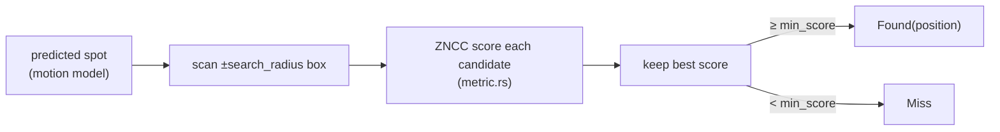
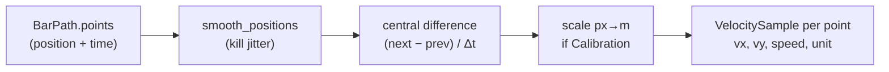
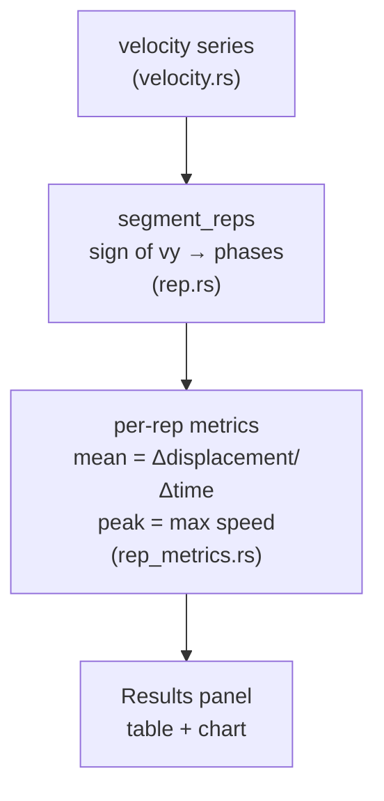

Top-level flow

```mermaid
graph TD
    UI["AppState.start_tracking()<br/>(app/state/jobs.rs)"] -->|spawns thread| Worker["run_tracking_worker()<br/>(tracking.rs:594)"]
    Worker --> Decode["FfmpegFrameSource.spawn()<br/>+ decode_up_to(seed)<br/>(tracking.rs)"]
    Decode --> Build["build tracker at seed<br/>Template / Color / Circle"]
    Build --> Finish["finish_tracking_run()<br/>(tracking.rs)"]
    Finish --> Loop["run_tracking_loop()<br/>the per-frame cycle"]
    Loop -->|每 frame: Progress msg| UI
    Loop -->|end: Done(BarPath)| UI
    UI -->|after Done| Derive["SessionResults::build<br/>velocity + reps<br/>(app/state/review.rs)"]
```

Two threads, one channel. The worker decodes + tracks; the UI polls messages. That separation is the 18.1 threading rule.

---
Step 1 — Buffering frames

Not one big buffer. Frames stream one at a time through the FrameSource port. FfmpegFrameSource pipes raw RGB out of an ffmpeg subprocess; next_frame() pulls the next one.

```rust
// tracking.rs — run_tracking_loop, the cycle
loop {
    // 1. check for Pause/Stop first (tracking.rs:~626)
    match control_rx.try_recv() { … Stop => return Stopped, … }

    // 2. pull ONE frame
    match source.next_frame()? {
        Some(frame) => {
            session.step(&frame, dt);          // <-- the decision (step 2)
            // emit this frame's result to the UI
            tx.send(TrackingMessage::Progress { video_frame_index, position, source, state });
        }
        None => return Ok(LoopOutcome::Completed),  // EOF
    }
}
```

Why streaming, not buffered: a squat video is thousands of frames of raw RGB — holding them all = gigabytes. One-at-a-time keeps memory flat. (The display side has a tiny 16-frame cache in decode_worker.rs, separate concern — that's for scrubbing, not tracking.)

dt = seconds per frame = 1 / fps. Passed into every step so the motion model knows how much time elapsed.

---
Step 2 — The decision: "where did the bar go?"

Two layers. TemplateTracker::step finds the raw best match; TrackingSession::step decides whether to trust it.

2a. The search (tracker.rs, TemplateTracker::step)

```rust
let predicted = track.predicted(dt);        // motion model guesses next spot
let (cx, cy) = (predicted.x, predicted.y);
let r = self.config.search_radius;
let mut best: Option<(Point, f64, …)> = None;

for dy in -r..=r {                          // scan a window around the prediction
    for dx in -r..=r {
        let candidate = /* patch at (cx+dx, cy+dy) */;
        let anchor_score   = metric.score(&self.anchor,   &candidate); // vs ORIGINAL seed
        let adaptive_score = metric.score(&self.adaptive, &candidate); // vs recent look
        let score = anchor_score.max(adaptive_score);
        if best.is_none_or(|(_, b, …)| score > b) {
            best = Some((Point::new(x, y), score, anchor_score, candidate));
        }
    }
}
match best {
    Some((position, score, …)) if score >= min_score => Found { position, … },
    _ => Miss,
}
```

Plain version: guess where the bar should be (motion model), scan a small box around that guess, score every position with ZNCC, keep the best. If the best is good enough → Found; else → Miss. The anchor vs adaptive split is the anchor-veto (17.3) that resists drift.



2b. The trust layer (session.rs, TrackingSession::step)

Found from the search isn't accepted blindly:

```rust
// session.rs — mid-gap guards demote a suspicious Found back to Miss
let outcome = match outcome {
    Found { position, .. } if in_gap && distance(last_pos, position) > max_reacquire_distance
        => Miss,                                  // too far to be real
    Found { score, .. }    if in_gap && score < reacquire_min_score
        => Miss,                                  // too weak to trust
    other => other,
};

match outcome {
    Found { position, identity_confidence, .. } => {
        self.track = self.track.observed(position, dt);   // update motion model
        self.last_pos = position;
        self.samples.push(Sample { frame_index, position, source: Tracked, confidence });
    }
    Miss => { /* coast the gap, maybe → NeedsReseed */ }
}
```

So the "decision" = search finds a candidate, session vetoes it against distance/score/confidence, then either records a Sample or opens a gap.

---
Step 3 — The data structure that stores the points

Each accepted frame becomes a Sample; the run's samples + gaps become the BarPath aggregate (bar_path.rs):

```rust
pub struct PathPoint {
    pub frame_index: u64,
    pub t_seconds: f64,     // frame_index × fps_den/fps_num  ← time attached here
    pub position: Point,    // x, y in pixels
    pub source: Source,     // Tracked / Interpolated / Seed
}

pub struct BarPath {
    points: Vec<PathPoint>, // the whole trajectory, time-stamped
    gaps: Vec<Gap>,
    // + timebase (rational fps)
}
```

This is the seam — the tracking side ends here, everything after is pure math on points. Note: a PathPoint stores position + time, not velocity. Velocity doesn't exist yet.

---
Step 4 — Velocity: NOT a sum of vectors

Here's your one misconception. You imagined storing little direction+speed vectors and summing them. The code doesn't. Velocity at each point = difference between its neighbours, divided by the time between them (calculus: velocity = derivative of position). This is "central finite difference."

```rust
// velocity.rs — velocity_series()
let smoothed = smooth_positions(points, window)?;   // 1. de-noise first (else jitter explodes)

for i in 0..n {
    let (lo, hi) = if i == 0        { (0, 1) }        // ends: one-sided
                   else if i == n-1 { (n-2, n-1) }
                   else             { (i-1, i+1) };   // interior: neighbours
    let dt = smoothed[hi].t_seconds - smoothed[lo].t_seconds;
    let dx = smoothed[hi].position.x - smoothed[lo].position.x;
    let dy = smoothed[hi].position.y - smoothed[lo].position.y;
    let vx = scale(dx) / dt;                          // 2. px (or metres) per second
    let vy = scale(dy) / dt;
    let speed = (vx*vx + vy*vy).sqrt();               // magnitude
}

```

Three things happening:
1. Smooth first — differencing raw jitter amplifies noise into fake velocity spikes, so positions get averaged over a window first.
2. Difference neighbours — (next − prev) / (time between). That's the instantaneous velocity at point i.
3. scale() — if a Calibration exists (you clicked plate edges), px_to_meters converts pixels→metres, so velocity comes out in m/s. No calibration → stays px/s. Same code, unit decided by whether calibration is present.



---
Step 5 — "avg velocity" = per-rep aggregation

The average velocity of the bar isn't over the whole video — it's per rep. rep.rs segments the velocity series into eccentric/concentric phases (sign of vy = bar going down vs up), then rep_metrics.rs aggregates each concentric phase:

- Mean velocity = concentric displacement ÷ concentric duration
- Peak velocity = max speed in that phase

That's the VBT number. So the chain is: positions → velocities (per point) → group into reps → average within each rep. No global vector sum anywhere.



---
Your navigation map

┌────────────────────────────────┬────────────────────────┬─────────────────────────────────────────────┐
│         To understand…         │          Open          │                Key function                 │
├────────────────────────────────┼────────────────────────┼─────────────────────────────────────────────┤
│ flow start / threading         │ app/state/jobs.rs      │ start_tracking, poll_tracking               │
├────────────────────────────────┼────────────────────────┼─────────────────────────────────────────────┤
│ decode + orchestration         │ tracking.rs            │ run_tracking_worker, run_tracking_loop:~620 │
├────────────────────────────────┼────────────────────────┼─────────────────────────────────────────────┤
│ the search ("where did it go") │ tracker.rs             │ TemplateTracker::step                       │
├────────────────────────────────┼────────────────────────┼─────────────────────────────────────────────┤
│ ZNCC similarity                │ metric.rs              │ Zncc::score                                 │
├────────────────────────────────┼────────────────────────┼─────────────────────────────────────────────┤
│ trust/veto/gaps                │ session.rs             │ TrackingSession::step                       │
├────────────────────────────────┼────────────────────────┼─────────────────────────────────────────────┤
│ storage aggregate              │ bar_path.rs            │ PathPoint, BarPath::new                     │
├────────────────────────────────┼────────────────────────┼─────────────────────────────────────────────┤
│ velocity math                  │ velocity.rs            │ velocity_series                             │
├────────────────────────────────┼────────────────────────┼─────────────────────────────────────────────┤
│ reps + averages                │ rep.rs, rep_metrics.rs │ segment_reps, per-rep metrics               │
└────────────────────────────────┴────────────────────────┴─────────────────────────────────────────────┘

Read them in that order and the whole pipeline unfolds top to bottom. Want me to go deep on any one box — the ZNCC math in metric.rs, or the rep segmentation in rep.rs?